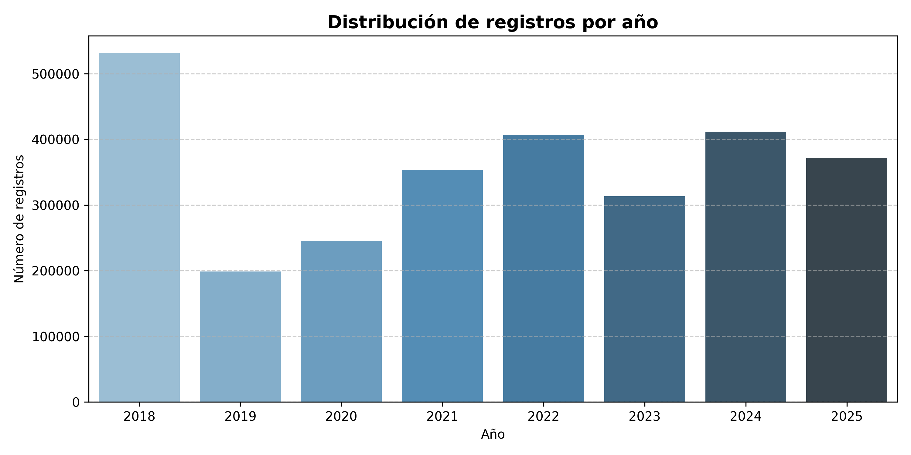
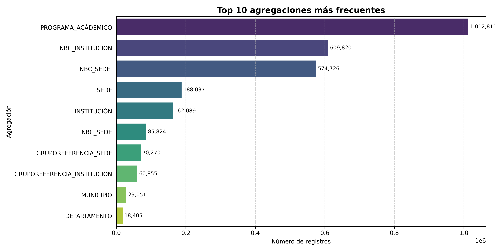
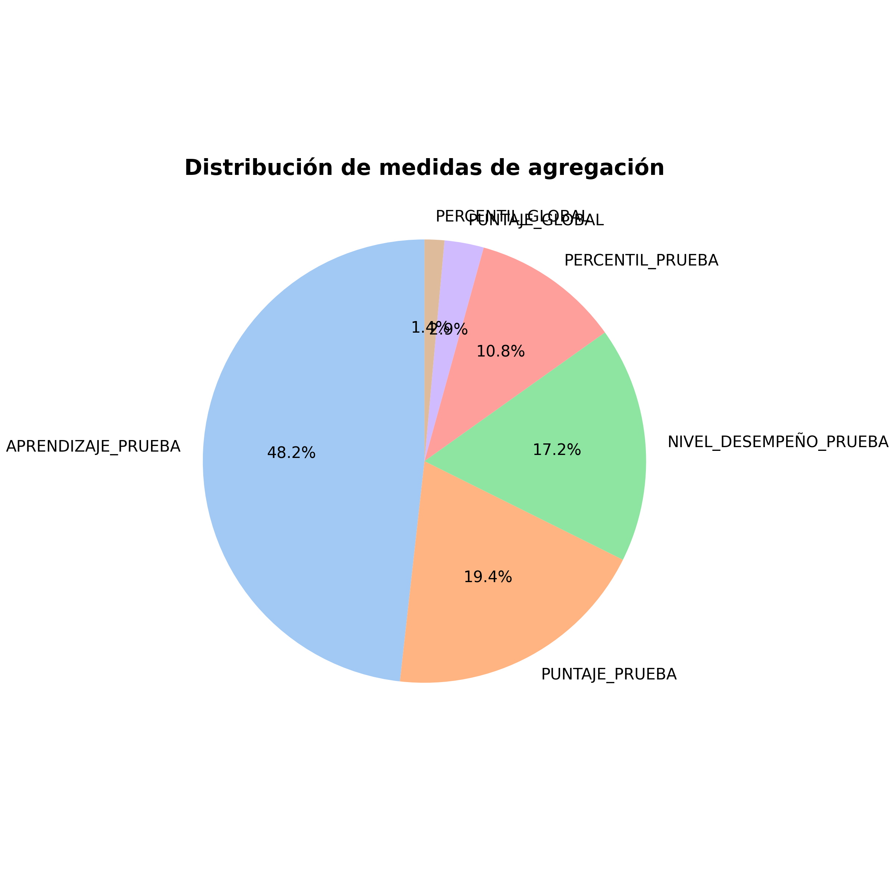
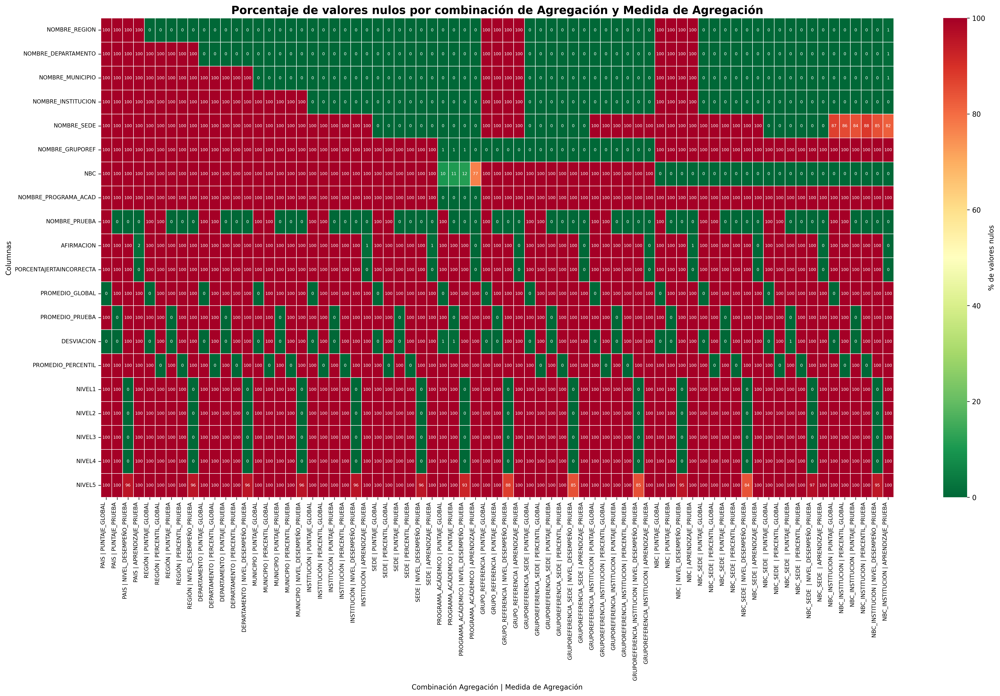
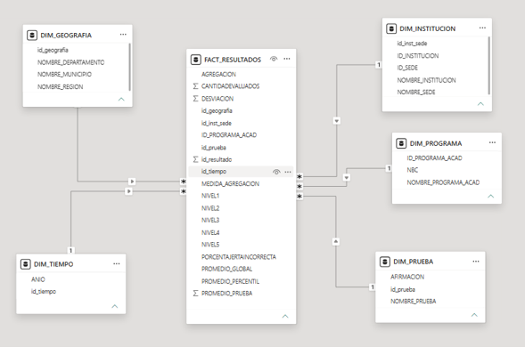
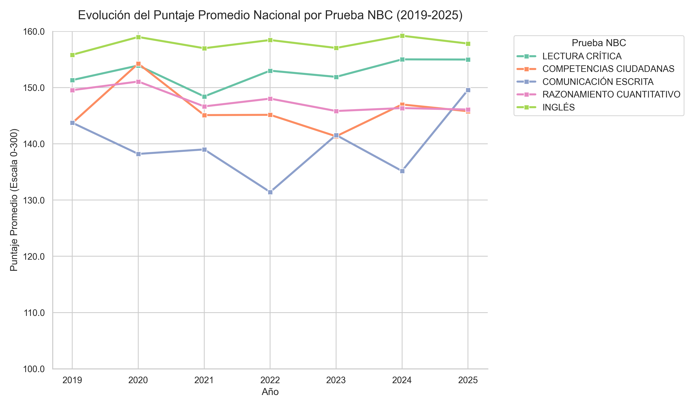
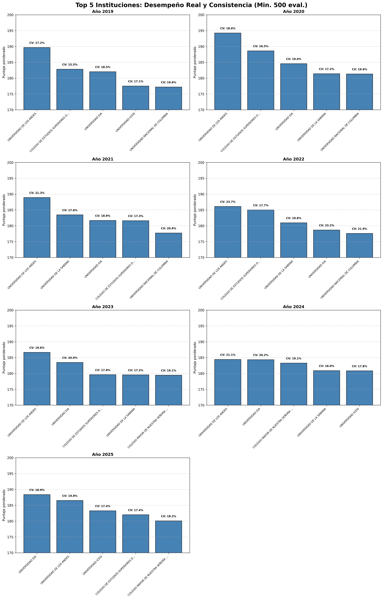
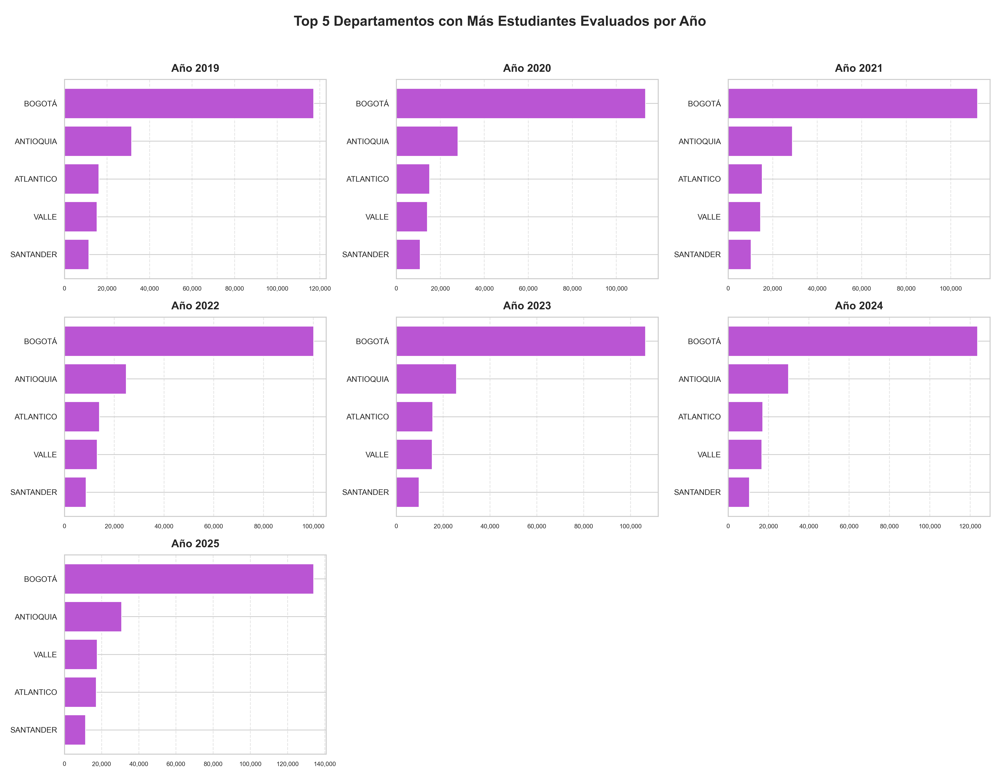
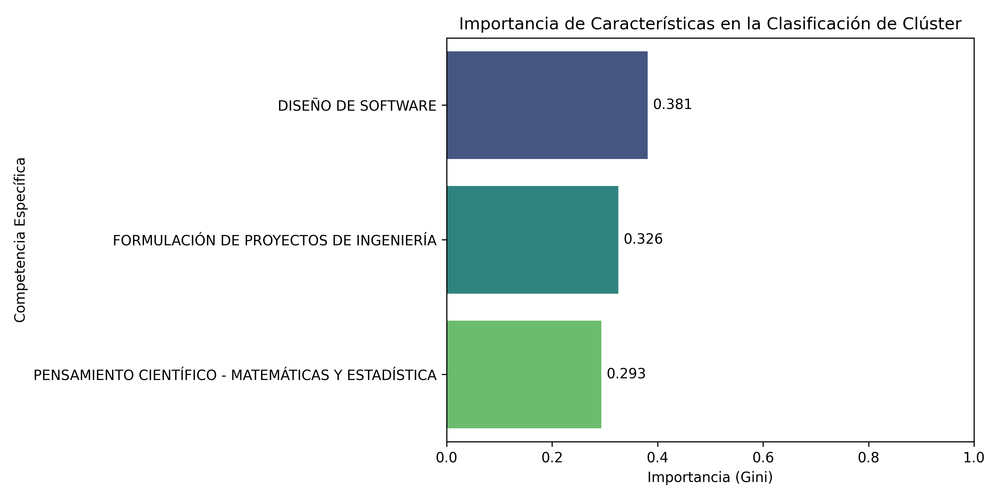
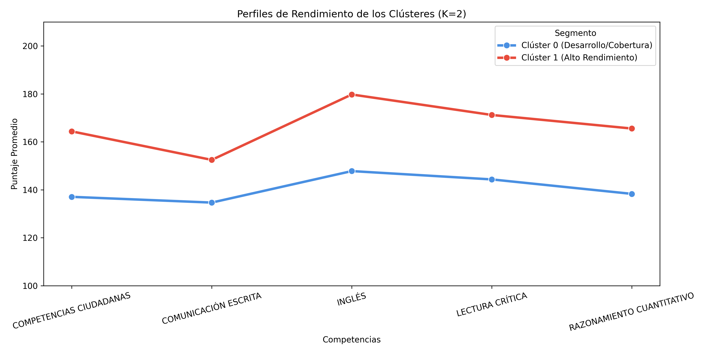

# Analítica de datos Viaje sobre los caminos de SaberPRO


# Capítulo 1: Introducción - El desafío de medir la educación superior

El presente proyecto busca mostrar un ejemplo, a partir de datos reales, de la aplicación del proceso de analítica de datos, desde la incorporación de datos en bruto, la preparación de los datos hasta el uso de los datos preparados para el descubrimiento de información intuitiva a partir de un análisis descriptivo.

Para este propósito se tomó como fuente de datos las bases de datos de resultados agregados de las pruebas ICFES Saber PRO de los últimos años disponibles públicamente.


## 1.1 ¿Qué son las pruebas Saber Pro y por qué importan?

En Colombia, el Instituto Colombiano para la Evaluación de la Educación (ICFES) administra el examen Saber Pro, también conocido como el Examen de Estado de Calidad de la Educación Superior. Esta prueba está dirigida a estudiantes que están finalizando sus carreras profesionales y tiene un propósito fundamental: evaluar las competencias genéricas y específicas que han desarrollado durante su formación universitaria.

Los resultados de Saber Pro no solo sirven como un indicador del desempeño individual de los estudiantes, sino que también se utilizan para:


-   Acreditar la calidad de los programas académicos ante el Ministerio de Educación.

-   Orientar políticas públicas en materia de educación superior.

-   Permitir a las instituciones educativas identificar fortalezas y áreas de mejora en sus currículos.

-   Ofrecer a los estudiantes y empleadores una referencia sobre el nivel de formación alcanzado.

En este contexto, el ICFES pone a disposición del público bases de datos de resultados agregados, que contienen información estadística sobre el desempeño de los estudiantes organizada por diferentes niveles de agregación: país, región, departamento, municipio, institución, sede y programa académico.


## 1.2 El problema: datos valiosos, pero complejos y desordenados

Si bien estas bases de datos son un tesoro de información pública, no vienen listas para ser analizadas. Como ocurre con muchos registros administrativos, los datos presentan una serie de desafíos que cualquier analista debe enfrentar antes de poder extraer conocimiento útil:

_Mezcla de niveles de agregación_: Una misma tabla contiene registros a nivel nacional, departamental, institucional y de programa. Esto genera una alta proporción de valores nulos en columnas que no aplican a ciertos niveles (por ejemplo, el 64% de los registros no tienen un programa académico asociado, porque corresponden a agregaciones geográficas).

_Errores de digitación y normalización_: Los nombres de programas académicos e instituciones presentan variaciones ortográficas, tildes mal ubicadas, espacios duros invisibles e incluso caracteres corruptos como _GEOLOG¿A_ en lugar de _GEOLOGÍA_.

_Inconsistencias entre fuentes oficiales_: Aunque el ICFES utiliza referencias como el SNIES (Sistema Nacional de Información de la Educación Superior) y el DIVIPOLA (División Político-Administrativa de Colombia), los identificadores numéricos no siempre coinciden, lo que dificulta la integración con otras bases de datos.

_Volumen de datos_: Con más de 2.8 millones de registros y 34 columnas, el manejo de este dataset requiere estrategias eficientes de almacenamiento y procesamiento.

_Formatos de archivo_: Los datos se distribuyen en archivos Excel, que pueden ser incómodos para trabajar con grandes volúmenes de información y requieren una conversión a formatos más ágiles como Parquet.


## 1.3 El objetivo de este proyecto

Este proyecto busca documentar, paso a paso, el proceso completo de análisis de datos aplicado a estas bases de datos del ICFES, con el propósito de:

Demostrar cómo se aborda un proyecto real de analítica de datos desde la extracción, pasando por la limpieza y transformación, hasta el análisis descriptivo y el modelado predictivo.

Mostrar los desafíos técnicos y las decisiones que enfrenta un analista de datos en cada etapa, incluyendo la gestión de memoria, la normalización de texto, la optimización de consultas y la integración de fuentes externas.

Extraer insights relevantes sobre el estado de la educación superior en Colombia, respondiendo preguntas como:


-   ¿Cómo ha evolucionado el rendimiento en las competencias genéricas entre 2019 y 2025?

-   ¿Cuáles son las instituciones con mejor desempeño consistente?

-   ¿Existen brechas regionales significativas?

-   ¿Qué factores académicos predicen el éxito en las pruebas?

Documentar subproductos útiles generados durante el proceso, como diccionarios de corrección, bases de datos relacionales y visualizaciones, que pueden ser reutilizados por otros analistas.


## 1.4 ¿Qué encontrará el lector en los siguientes capítulos?

A lo largo de este recorrido, el lector acompañará al analista en las siguientes fases:

| Capítulo | Tema | Qué se aborda |
| --- | --- | --- |
| 2 | Recopilación de datos | La extracción de 8 años de datos desde archivos Excel, la consolidación en un dataset único y la conversión a formatos eficientes. |
| 3 | Exploración y perfilamiento | El análisis de estructura de los datos, la identificación de nulos estratégicos y los primeros hallazgos. |
| 4 | Limpieza y transformación (ETL) | La normalización de texto, la creación de diccionarios, la corrección de errores ortográficos y la optimización de memoria. |
| 5 | Modelado de datos | El diseño de una base de datos relacional en SQLite, la resolución de conflictos de unicidad y la carga de datos. |
| 6 | Análisis exploratorio | La respuesta a preguntas clave a través de consultas SQL y visualizaciones. |
| 7 | Modelado predictivo | La construcción de un clasificador de alto rendimiento utilizando Random Forest. |
| 8 | Conclusiones | Las lecciones aprendidas, las limitaciones del estudio y los próximos pasos. |


## 1.5 Fuentes de datos y referencias metodológicas

Este proyecto se apoya en las siguientes fuentes oficiales:


**ICFES (Instituto Colombiano para la Evaluación de la Educación):** Bases de datos de resultados agregados de Saber Pro (2018-2025).

https://www.icfes.gov.co/evaluaciones-icfes/acerca-del-examen-saber-pro/resultados-del-examen-saber-pro/


**Marco metodológico y ficha metodológica del ICFES:** Documentos que describen las fórmulas estadísticas y los niveles de agregación utilizados.

https://www.icfes.gov.co/analisis-de-datos/


**SNIES (Sistema Nacional de Información de la Educación Superior):** Base de datos de programas académicos registrados oficialmente.

https://hecaa.mineducacion.gov.co/consultaspublicas/programas


**DIVIPOLA (División Político-Administrativa de Colombia):** Listados oficiales de departamentos y municipios.

https://geoportal.dane.gov.co/descargas/divipola/Listados_DIVIPOLA.xlsx

A lo largo del proceso, se aplicarán las definiciones y fórmulas establecidas en la metodología del ICFES, asegurando que los resultados sean coherentes con las prácticas oficiales.


## 1.6 Un vistazo rápido a los datos

Para que el lector tenga una idea del material con el que vamos a trabajar, aquí hay un resumen de la estructura del dataset original:


-   _Volumen_: _2,832,345_ registros

-   _Columnas_: _34_

-   _Años cubiertos_: _2018-2025_

-   _Niveles de agregación_: País, región, departamento, municipio, institución, sede, programa académico, NBC (Núcleo Básico del Conocimiento).

-   _Métricas principales_: PROMEDIO_GLOBAL, PROMEDIO_PRUEBA, DESVIACION, PROMEDIO_PERCENTIL, NIVEL1 a NIVEL5, PORCENTAJERTAINCORRECTA.

-   _Variables textuales clave_: NOMBRE_PROGRAMA_ACAD, NOMBRE_INSTITUCION, NOMBRE_SEDE, NBC, AFIRMACION.

Este dataset es rico, pero como veremos, también está lleno de vericuetos y desafíos que ponen a prueba las habilidades del analista.

# Capítulo 2: Recopilación de datos - El arte de extraer información del mundo real

A continuación, el segundo capítulo de la narrativa, centrado en la fase de **Recopilación (Extracción)**. Donde se irán mostrando los desafíos reales que enfrenta un analista al obtener datos de fuentes heterogéneas.


## 2.1 El punto de partida: conseguir los datos

Antes de poder limpiar, transformar o analizar cualquier dato, hay que **obtenerlos**. Puede sonar trivial, pero en la práctica, esta fase suele ser una de las más tediosas y propensas a errores. En nuestro caso, el ICFES publica los resultados de Saber Pro en archivos Excel, uno por cada año, disponibles para descarga pública en su portal de datos abiertos.

Los archivos tienen un patrón de nombre predecible:

_Base-de-datos-de-resultados-agregados-de-saber-pro-{year}.xlsx_

Donde {year} va desde 2018 hasta 2025 (el año más reciente disponible al momento de este análisis). Esto significa que tenemos que manejar **8 archivos diferentes**, cada uno con **más de 300 mil filas**. El volumen total supera los **2.8 millones de registros**.


## 2.2 El primer desafío: heterogeneidad estructural

A simple vista, todos los archivos deberían tener la misma estructura porque provienen de la misma fuente. Sin embargo, al inspeccionarlos, encontramos diferencias importantes:


-   **Columnas faltantes en años antiguos**: El archivo de 2018, por ejemplo, carece de varias columnas que sí existen en años posteriores, como ID_REGION, ID_DEPARTAMENTO, ID_MUNICIPIO, ID_GRUPOREFERENCIA, ID_NBC, ID_PROGRAMA_ACAD y CATEGORIAPRUEBA. Estas columnas fueron añadidas por el ICFES en versiones posteriores de los reportes.

-   **Nombres de columnas inconsistentes**: En algunos años, la columna que identifica el Núcleo Básico del Conocimiento se llamaba NOMBRE_NBC, mientras que en otros se llamaba simplemente NBC. Si no se estandariza, esto provoca errores al consolidar los datos.

-   **Tipos de datos variables**: Aunque la mayoría de las columnas numéricas son float, el año 2018 tenía algunas columnas como object que en otros años eran int. Esto obliga a realizar conversiones explícitas.

Estas variaciones no son errores del ICFES, sino **evoluciones naturales del sistema de información**. A medida que la entidad mejora sus procesos, añade nuevas variables o ajusta las existentes. Para el analista, esto significa que no podemos asumir que todos los archivos son iguales; debemos construir un mecanismo que **detecte y maneje estas diferencias de forma automática**.


## 2.3 Diseñando una función de carga robusta

Para abordar este desafío, se diseñó una función en Python que:

1.  **Recibe el año y la ruta del archivo** como parámetros.
2.  **Lee el archivo Excel** con pandas.read_excel().
3.  **Verifica qué columnas están presentes** comparando con una lista de columnas esperadas.
4.  **Añade las columnas faltantes** con valores vacíos (para mantener la estructura uniforme).
5.  **Estandariza nombres de columnas** cuando sea necesario (por ejemplo, renombrando NOMBRE_NBC a NBC).
6.  **Añade una columna** ANIO para identificar el año de cada registro.
7.  **Reordena las columnas** para que todos los DataFrames tengan exactamente el mismo orden.

Este enfoque garantiza que, independientemente del año, el resultado sea un DataFrame con la misma estructura, listo para ser consolidado.

```python
def load_saber_pro_year(year, filepath):
    archivo = filepath / f"Base-de-datos-de-resultados-agregados-de-saber-pro-{year}.xlsx"
    if not archivo.exists():
        print(f"⚠️ Archivo no encontrado: {archivo}")
        return None

    df = pd.read_excel(archivo)

    # Estandarizar nombre de columna histórica a NBC
    if 'NOMBRE_NBC' in df.columns:
        df.rename(columns={'NOMBRE_NBC': 'NBC'}, inplace=True)

    # Lista de columnas esperadas (34 columnas)
    columnas_esperadas = [
        'EXAMEN', 'AGREGACION', 'MEDIDA_AGREGACION', 'CANTIDADEVALUADOS', 'ID_PAIS', 'ID_REGION', 'NOMBRE_REGION', 'ID_DEPARTAMENTO', 'NOMBRE_DEPARTAMENTO', 'ID_MUNICIPIO', 'NOMBRE_MUNICIPIO', 'ID_INSTITUCION', 'NOMBRE_INSTITUCION', 'ID_SEDE', 'NOMBRE_SEDE', 'ID_GRUPOREFERENCIA', 'NOMBRE_GRUPOREF', 'ID_NBC', 'NBC', 'ID_PROGRAMA_ACAD', 'NOMBRE_PROGRAMA_ACAD', 'NOMBRE_PRUEBA', 'CATEGORIAPRUEBA', 'PROMEDIO_GLOBAL', 'PROMEDIO_PRUEBA', 'DESVIACION', 'PROMEDIO_PERCENTIL', 'NIVEL1', 'NIVEL2', 'NIVEL3', 'NIVEL4', 'NIVEL5', 'AFIRMACION', 'PORCENTAJERTAINCORRECTA'
    ]

    # Identificar columnas faltantes
    columnas_faltantes = [col for col in columnas_esperadas if col not in df.columns]

    if columnas_faltantes:
        print(f"⚠️ Estructura incompleta en el año {year}. Faltan: {columnas_faltantes}. Se añadirán vacías.")
        for col in columnas_faltantes:
            df[col] = pd.Series(dtype="object")

    # Asegurar el orden exacto de las columnas esperadas
    df = df[columnas_esperadas]

    # Añadir columna de año para trazabilidad
    df['ANIO'] = year
    return df
```

**_Nota:_** _Los códigos mostrados contienen variaciones con respecto al script original._


## 2.4 La consolidación: uniendo 8 años en un solo dataset

Con la función de carga lista, el siguiente paso es iterar sobre los años, cargar cada archivo y concatenarlos en un único DataFrame. Utilizamos pd.concat() para unir todos los DataFrames de forma eficiente.

```python
years = list(range(2018, 2026))
dataframes = []

for year in years:
    df_year = load_saber_pro_year(year, filepath)
    if df_year is not None:
        dataframes.append(df_year)
        print(f"✓ Cargado {year}: {len(df_year):,} filas")

if dataframes:
    sabpro_full = pd.concat(dataframes, ignore_index=True)
    print(f"Total consolidado: {len(sabpro_full):,} registros")
```

El resultado de este proceso:

| Año | Registros cargados |
| --- | --- |
| 2018 | 531,201 |
| 2019 | 198,849 |
| 2020 | 245,234 |
| 2021 | 353,498 |
| 2022 | 406,672 |
| 2023 | 313,455 |
| 2024 | 411,946 |
| 2025 | 371,490 |
| Total | 2,832,345 |


**_Nota_**_: La variación en el número de filas por año no es un error; refleja cambios en la cantidad de estudiantes evaluados y en los niveles de agregación reportados por el ICFES._


## 2.5 La elección del formato: ¿Por qué Parquet?

El dataset consolidado en memoria ocupa aproximadamente **3.2 GB**. Si se trabaja directamente con el DataFrame en cada sesión, habrá que repetir la carga y consolidación cada vez, lo cual es ineficiente. Por eso, se decidió exportar el dataset a un formato más eficiente: **Apache Parquet**.


**Ventajas de Parquet:**


-   **Compresión**: Parquet reduce significativamente el tamaño del archivo (se pasó de 3.2 GB en memoria a ~800 MB en disco).

-   **Velocidad de carga**: La lectura de archivos Parquet es mucho más rápida que la de Excel o CSV, especialmente para datasets grandes.

-   **Preservación de tipos**: Parquet conserva los tipos de datos de las columnas (int, float, string, etc.), evitando conversiones innecesarias.

-   **Columnar**: Al ser un formato columnar, permite leer solo las columnas necesarias, lo que acelera consultas específicas.

```python
sabpro_full.to_parquet('saberpro_2018_2025.parquet')
```

A partir de este punto, cada vez que necesitemos trabajar con los datos, simplemente cargaremos el archivo Parquet, lo que reduce el tiempo de inicio de 15 minutos a menos de 10 segundos.


## 2.6 ¿Y las fuentes complementarias? (SNIES y DIVIPOLA)

Además de los datos del ICFES, este proyecto utiliza dos fuentes externas para enriquecer y validar la información:


-   **SNIES (Sistema Nacional de Información de la Educación Superior)**: Contiene el catálogo oficial de programas académicos registrados en Colombia. Se utiliza para normalizar los nombres de los programas y verificar su existencia.

-   **DIVIPOLA (División Político-Administrativa de Colombia)**: Proporciona los códigos y nombres oficiales de departamentos y municipios. Ayuda a estandarizar los nombres geográficos, aunque como veremos más adelante, el ICFES no utiliza exactamente los mismos códigos.

Ambas fuentes se descargan en formato Excel y se procesan de manera similar, aunque su tamaño es mucho menor (SNIES: 31,083 registros; DIVIPOLA: ~1,200 registros). También se exportan a Parquet para facilitar su reutilización.


## 2.7 Subproducto de esta fase: el dataset consolidado en Parquet

Al final de esta etapa, se ha generado un activo clave: _saberpro_2018_2025.parquet_. Este archivo contiene todos los datos crudos, con las columnas estandarizadas, listo para la siguiente fase: la exploración y el perfilamiento.


**¿Qué se ha logrado hasta ahora?**

| Aspecto | Resultado |
| --- | --- |
| Volumen de datos | 2,832,345 registros, 34 columnas |
| Cobertura temporal | 2018-2025 (8 años) |
| Formatos manejados | Excel (entrada) → Parquet (salida) |
| Tiempo de carga* | ~15 minutos (la primera vez) → <10 segundos (posterior) |
| Estructura homogeneizada | Todas las columnas presentes en todos los años |

_\* Se refiere al tiempo estimado de lectura de datos del archivo consolidado en parquet comparado con la consolidación inicial del dataframe cargando archivo por archivo en formato excel ._


## 2.8 El primer gran descubrimiento: los nulos no son siempre errores

Al inspeccionar los datos consolidados, se notó que muchas columnas tienen un alto porcentaje de valores nulos. Por ejemplo:


-   ID_PROGRAMA_ACAD: 69.8% nulos

-   NOMBRE_PROGRAMA_ACAD: 64.2% nulos

-   DESVIACION: 77.8% nulos

A simple vista, esto podría interpretarse como una mala calidad de los datos. Sin embargo, al analizar la columna AGREGACION, se descubrió la razón: los registros no son homogéneos. Algunos corresponden a agregaciones a nivel de **programa académico**, otros a nivel de **departamento**, **institución** o incluso **país**. Es lógico que un registro a nivel de departamento no tenga un ID de programa asociado.


**Lección clave**: En datasets agregados, los valores nulos no siempre son errores; a menudo reflejan la estructura jerárquica de los datos. Comprender esta estructura es fundamental para no tomar decisiones equivocadas en etapas posteriores.


## **Nota para el lector**

Este capítulo ha mostrado el **primer gran desafío** del análisis de datos: conseguir los datos y ponerlos en un formato manejable, manteniendo la integridad y la trazabilidad. Hemos visto cómo una función de carga bien diseñada puede resolver problemas de heterogeneidad estructural y cómo la elección del formato de almacenamiento impacta la eficiencia del flujo de trabajo.

En el siguiente capítulo, **Exploración y perfilamiento**, comenzaremos a entender realmente qué contienen estos datos, qué preguntas podemos responder y qué problemas de calidad debemos abordar antes de poder analizarlos.

# Capítulo 3: Exploración y perfilamiento - Conocer al enemigo (los datos)

Una vez que los datos están consolidados y almacenados en un formato eficiente, comienza la fase más fascinante y, a menudo, la más reveladora del proceso: la **exploración**. Esta etapa no consiste en la aplicación de fórmulas complejas ni construcción de modelos; se trata de **entender qué tenemos entre manos**, qué nos dicen los datos, cuáles son sus limitaciones y, sobre todo, qué preguntas podemos llegar a responder.

En este capítulo, acompañaremos al analista en su primer contacto profundo con el dataset consolidado. Veremos cómo se enfrenta a la estructura de los datos, cómo descubre patrones ocultos y cómo toma decisiones que marcarán el rumbo de todo el proyecto.


## 3.1 El primer vistazo: ¿qué hay en este dataset?

Cuando un analista recibe un dataset nuevo, su primer instinto es **explorar su estructura**. No se trata de un análisis profundo, sino de una **inspección visual y estadística rápida** que permita responder preguntas básicas:


-   ¿Cuántas filas y columnas tiene?

-   ¿Qué tipos de datos contiene cada columna?

-   ¿Cuántos valores faltan y en qué columnas?

-   ¿Cuáles son los valores únicos de las columnas categóricas?

-   ¿Cómo se distribuyen las variables numéricas?

Para el dataset consolidado (2.8 millones de filas y 34 columnas), estas preguntas no pueden responderse simplemente mirando una tabla. Son necesarias herramientas que ayuden a resumir la información de forma eficiente.


**Herramienta elegida**: pandas con sus métodos _info()_, _describe()_ y _value\_counts()_, complementados con funciones personalizadas de perfilamiento que generan tablas de resumen por tipo de variable.


### 3.1.1 Perfilamiento de variables numéricas

Para las columnas numéricas, se generó un resumen que incluye el porcentaje de valores nulos, el número de valores únicos, el mínimo, máximo, media, mediana y desviación estándar. Estos estadísticos nos dan una primera idea de la escala y la distribución de cada variable.

A continuación, se muestra una versión resumida de ese perfil:

| Columna | Nulos (%) | Únicos | Mínimo | Máximo | Media | Mediana | Desv. Estándar |
| --- | --- | --- | --- | --- | --- | --- | --- |
| CANTIDADEVALUADOS | 0.00% | 18,905 | 1 | 3,360,108 | 730.5 | 100 | 12,397 |
| ID_INSTITUCION | 2.40% | 238 | 5,264 | 33,840 | 9,160.8 | 9,049 | 1,429.6 |
| PROMEDIO_GLOBAL | 97.13% | 152 | 0 | 240 | 149.6 | 148 | 16.0 |
| PROMEDIO_PRUEBA | 80.57% | 220 | 0 | 300 | 148.6 | 147 | 19.4 |
| DESVIACION | 77.84% | 132 | 0 | 150 | 26.5 | 26 | 9.2 |
| NIVEL1 | 82.80% | 100 | 0 | 100 | 22.2 | 17 | 20.3 |
| ... | ... | ... | ... | ... | ... | ... | ... |


**Observaciones clave**:


-   **CANTIDADEVALUADOS** tiene un máximo muy alto (3.36 millones) comparado con la mediana (100). Esto indica que hay algunas agregaciones con un número desproporcionadamente grande de estudiantes (probablemente a nivel nacional o departamental).

-   **PROMEDIO\_GLOBAL** y **PROMEDIO\_PRUEBA** tienen más del 80% de valores nulos. Esto no es un error, sino que estas métricas solo existen para ciertos niveles de agregación (como programa académico), y no para agregaciones geográficas o institucionales.

-   **DESVIACION** presenta un comportamiento similar: solo existe cuando hay una agregación con múltiples estudiantes.


### 3.1.2 Perfilamiento de variables de texto

Para las columnas de texto, el resumen incluye el número de valores únicos, la longitud media de los textos y ejemplos representativos. Esto es especialmente útil para detectar problemas de calidad como variaciones ortográficas, espacios extra o caracteres especiales.

| Columna | Nulos (%) | Únicos | Longitud media | Ejemplos |
| --- | --- | --- | --- | --- |
| EXAMEN | 0.00% | 8 | 16 | 'SABER PRO - 2018', 'SABER PRO - 2019' |
| AGREGACION | 0.00% | 14 | 13.9 | 'DEPARTAMENTO', 'INSTITUCIÓN', 'PROGRAMA_ACÁDEMICO' |
| NOMBRE_REGION | 0.69% | 5 | 6.3 | 'ANDINA', 'CARIBE', 'PACÍFICA' |
| NOMBRE_INSTITUCION | 2.40% | 243 | 34.2 | 'PONTIFICIA UNIVERSIDAD JAVERIANA', ... |
| NOMBRE_PROGRAMA_ACAD | 64.24% | 1,199 | 22.9 | 'INGENIERIA INDUSTRIAL', 'NUTRICION Y DIETETICA' |
| NOMBRE_PRUEBA | 4.31% | 48 | 23.1 | 'COMPETENCIAS CIUDADANAS', 'RAZONAMIENTO CUANTITATIVO' |
| AFIRMACION | 51.97% | 120 | 97.2 | Textos largos sobre competencias evaluadas |
| ... | ... | ... | ... | ... |


**Observaciones clave**:


-   **NOMBRE\_PROGRAMA\_ACAD** tiene un 64% de nulos, pero como vimos en el capítulo anterior, esto se debe a que muchos registros corresponden a agregaciones superiores (departamentos, instituciones, etc.) que no tienen un programa asociado.

-   **NOMBRE\_INSTITUCION** tiene solo 243 valores únicos, lo que indica que hay relativamente pocas instituciones reportadas (coherente con el sistema universitario colombiano).

-   **AFIRMACION** tiene textos largos (97 caracteres de media) y también muchos nulos (52%), porque solo aparece en registros de APRENDIZAJE\_PRUEBA.


## 3.2 El descubrimiento clave: la lógica detrás de los nulos

Uno de los hallazgos más importantes de esta fase fue comprender que **los valores nulos no son aleatorios, sino que están determinados por la columna** AGREGACION. Para confirmar esta hipótesis, se agruparon los datos por tipo de agregación y se calculó el porcentaje de valores no nulos en columnas clave.

El resultado fue revelador:

| AGREGACION | Total registros | % ID_PROGRAMA_ACAD no nulo | % NOMBRE_PROGRAMA_ACAD no nulo |
| --- | --- | --- | --- |
| PROGRAMA_ACÁDEMICO | 1,012,811 | 84.46% | 100% |
| INSTITUCIÓN | 162,089 | 0% | 0% |
| SEDE | 188,037 | 0% | 0% |
| DEPARTAMENTO | 18,405 | 0% | 0% |
| MUNICIPIO | 29,051 | 0% | 0% |
| NBC | 14,073 | 0% | 0% |
| ... | ... | ... | ... |


**Interpretación**:


-   Solo los registros con AGREGACION = 'PROGRAMA\_ACÁDEMICO' tienen información de programa académico (ID y nombre).

-   Las agregaciones superiores (país, región, departamento, municipio, institución) no tienen programa, porque su nivel de detalle es más grueso.

-   Los registros con AGREGACION = 'NBC' (Núcleo Básico del Conocimiento) tampoco tienen programa, porque agrupan por área de conocimiento, no por carrera específica.


**Conclusión fundamental**: Cualquier análisis que requiera información de programa académico debe filtrar por AGREGACION = 'PROGRAMA\_ACÁDEMICO'. De lo contrario, se corre el riesgo de mezclar niveles de detalle y obtener resultados erróneos.


## 3.3 La consistencia de los nombres: el problema de las variantes textuales

Otra línea de exploración se centró en la **calidad de los nombres**. Al inspeccionar los valores únicos de NOMBRE\_PROGRAMA\_ACAD, se encontró que un mismo programa podía aparecer con diferentes variantes ortográficas:


-   ADMINISTRACION DE EMPRESAS vs ADMINISTRACIÓN DE EMPRESAS

-   INGENIERIA ELECTRONICA vs INGENIERÍA ELECTRÓNICA

-   GEOLOG¿A (con un carácter corrupto) vs GEOLOGÍA

Mediante técnicas de normalización (usando unicodedata y expresiones regulares), se logró detectar **173 grupos de colisiones textuales**, es decir, conjuntos de nombres que eran esencialmente iguales pero diferían en tildes, espacios o caracteres especiales.

Para resolver esto, se construyó un **diccionario de corrección** que mapea cada variante a una versión canónica (con tildes, mayúsculas y sin errores ortográficos). Este diccionario se refinó manualmente y se aplicó al dataset, reduciendo el número de programas únicos de 1,199 a 728.


## 3.4 El análisis cronológico: el año 2018 como un caso especial

Durante la exploración, se notó que el año 2018 presentaba una anomalía: **el 100% de los registros de** PROGRAMA\_ACÁDEMICO **tenían** ID\_PROGRAMA\_ACAD **nulo**. Esto significaba que no había información de programa para ese año, lo que imposibilitaba cualquier análisis que requiriera identificar carreras.

Al investigar más a fondo se descubrió que la estructura del archivo de 2018 era diferente: las columnas de ID no existían en el archivo original, y al momento de la carga fueron añadidas vacías. Adicionalmente, para el campo NOMBRE\_SEDE se detectó que el 100% de valores nulos para el campo NBC\_SEDE se ubicaba en este año. Por lo tanto, el año 2018 se consideró **inutilizable** para análisis a nivel de programa y sedes.

Hubo una decisión difícil de tomar, pero necesaria: **excluir el año 2018 del análisis**. Esto redujo el dataset de 2.83 millones a 2.30 millones de registros, pero garantizó la integridad de los datos y la consistencia de las conclusiones.


## 3.5 Primeras visualizaciones: el pulso de los datos

Aunque el análisis exploratorio se centra en números y tablas, las visualizaciones ayudan a comunicar hallazgos de forma intuitiva. Durante esta fase, se generaron gráficos como:


-   **Distribución de registros por año**: muestra que 2018 tenía la mayor cantidad de registros (531k), seguido de 2024 (411k) y 2022 (406k). Esto refleja variaciones en la cantidad de estudiantes evaluados y en los niveles de agregación reportados.


****


-   **Frecuencia de agregaciones**: más del 35% de los registros corresponden a PROGRAMA\_ACÁDEMICO, seguido de NBC\_INSTITUCION (21%) y SEDE (6.6%). Esto ayuda a entender qué nivel de detalle predomina.


****


-   **Distribución de medidas de agregación**: APRENDIZAJE\_PRUEBA es la más frecuente (48%), seguida de PUNTAJE\_PRUEBA (19%) y NIVEL\_DESEMPEÑO\_PRUEBA (17%). Esto indica que los datos incluyen múltiples perspectivas de análisis (puntajes, niveles, aprendizaje).


****


-   **Agregación y Medida - Heatmap**: un mapa de calor que muestra la distribución de nulos en todas las columnas clave, cruzando las combinaciones de _AGREGACION_ y _MEDIDA\_AGREGACION_. Este gráfico revela patrones que muestran la granularidad de datos, determinando qué campos son los más relevantes para el análisis de cada tipo de agregación.


****

Estos gráficos no solo son útiles para el analista, sino que también sirven para comunicar a otras partes interesadas (como responsables de políticas educativas) la naturaleza y la complejidad de los datos.


## 3.6 Subproductos de esta fase


-   **Glosario de columnas**: un documento que describe el significado de cada columna, basado en la metodología del ICFES.

-   **Tablas de perfilamiento numérico y de texto**: resúmenes estadísticos exportados a Excel para referencia rápida.

-   **Diccionario de corrección de nombres**: un archivo CSV que contiene las variantes ortográficas y sus versiones corregidas.

-   **Decisión documentada sobre 2018**: justificación clara de por qué se excluyó ese año, que quedará registrada en el portafolio.


## 3.7 Lo aprendido en esta fase


-   **Los nulos no son siempre errores**: a veces reflejan la estructura jerárquica de los datos. Comprender esto es esencial para no tomar decisiones equivocadas.

-   **La calidad textual importa**: los nombres de programas e instituciones necesitan ser normalizados para poder agrupar y comparar correctamente.

-   **Los años antiguos pueden ser problemáticos**: la evolución de los sistemas de información puede dejar rezagados datos de años pasados.

-   **La exploración nunca es un paso "rápido"**: requiere tiempo, atención al detalle y múltiples iteraciones. Pero es la base sobre la que se construye todo el análisis posterior.


## **Nota para el lector**

Este capítulo ha mostrado cómo el analista, armado con herramientas de exploración y una mentalidad curiosa, comienza a **desentrañar la lógica detrás de los datos**. No se trata solo de calcular estadísticas, sino de **interpretar** lo que esas estadísticas significan en el contexto del problema.

En el siguiente capítulo, **Limpieza y transformación**, veremos cómo se aplican las correcciones necesarias para dejar los datos listos para el modelado y el análisis profundo.

# Capítulo 4: Limpieza y transformación - La artesanía de los datos

Tras la exploración, el analista ya conoce la estructura, los problemas y las oportunidades del dataset. Pero conocer el problema no es suficiente; hay que resolverlo. Esta fase, conocida en la jerga como **ETL (Extracción, Transformación y Carga)**, es donde los datos pasan de ser un material bruto a convertirse en un producto refinado, listo para el análisis.

En este capítulo, acompañaremos al analista en el taller de los datos. Veremos cómo se enfrenta a la normalización de textos, la corrección de errores, la optimización de memoria y la creación de diccionarios que permitirán limpiar de forma sistemática los nombres de programas, instituciones y áreas de conocimiento.


## 4.1 El problema fundamental: datos escritos por humanos (y por sistemas que no se hablan entre sí)

Si hay una lección que todo analista de datos aprende rápidamente, es esta: **los datos que vienen de sistemas reales siempre están “_sucios_”**. No porque haya mala intención, sino porque:


-   **Diferentes personas ingresan datos** con distintos criterios ortográficos, abreviaturas y formatos.

-   **Los sistemas evolucionan** y cambian sus estándares internos, dejando datos antiguos con estructuras diferentes.

-   **Errores de codificación** pueden convertir una tilde en un carácter extraño, como _GEOLOG¿A_ en lugar de _GEOLOGÍA_.

-   **Espacios invisibles** (como el espacio duro \\xa0 de Windows) pueden romper comparaciones entre textos que parecen iguales.

En este caso, el principal desafío de limpieza se concentraba en las **columnas de texto**, especialmente en:


-   NOMBRE\_PROGRAMA\_ACAD (programas académicos)

-   NOMBRE\_INSTITUCION (instituciones de educación superior)

-   NOMBRE\_SEDE (sedes universitarias)

-   NBC (Núcleo Básico del Conocimiento)

Estas columnas son fundamentales para cualquier análisis que quiera agrupar por programa, institución o área de conocimiento. Si sus valores no son consistentes, cualquier conclusión será errónea.


## 4.2 Estrategia general de limpieza: capas, no balazos

Un error común en la limpieza de datos es intentar resolver todos los problemas con un único script "mágico" que lo arregle todo. La experiencia enseña que este enfoque casi siempre falla, porque los problemas de calidad son de distintos tipos y requieren soluciones específicas.

El enfoque adoptado aquí consiste en **trabajar por capas**, atacando cada tipo de problema con la herramienta adecuada:

1.  **Limpieza de caracteres base**: eliminar espacios extra, convertir a mayúsculas, corregir codificación.
2.  **Normalización por reglas**: usar expresiones regulares para estandarizar patrones comunes (ej. espacios múltiples, guiones).
3.  **Corrección de errores específicos**: construir un diccionario de correcciones para casos conocidos (ej. GEOLOG¿A → GEOLOGÍA).
4.  **Consolidación mediante vocabulario**: extraer el conjunto de palabras únicas, corregirlas una a una, y luego reconstruir los nombres completos.

Este enfoque en capas permite que cada etapa resuelva un grupo de problemas sin complicar las demás, y hace que el proceso sea más fácil de depurar, documentar y explicar.


## 4.3 La capa base: normalización de caracteres

El primer paso es aplicar una normalización uniforme a todas las columnas de texto. Esto incluye:


-   **Convertir a mayúsculas**: elimina las diferencias entre "Ingeniería" e "ingeniería".

-   **Eliminar espacios múltiples**: reemplazar _"UNIVERSIDAD DE ANTIOQUIA"_ por _"UNIVERSIDAD DE ANTIOQUIA"_.

-   **Eliminar espacios al inicio y al final**.

-   **Normalizar caracteres Unicode**: usar unicodedata.normalize('NFC', texto) para garantizar que las tildes y otros diacríticos estén representados de forma consistente.

```python
def normalizar_base(texto):
    if pd.isna(texto):
        return texto
    texto = texto.upper().strip()
    texto = re.sub(r'\s+', ' ', texto)  # espacios múltiples a uno
    return texto
```

Este paso parece sencillo, pero ya resuelve una gran parte de los problemas. Por ejemplo, transforma _"Administracion de Emrpesas "_ en _"ADMINISTRACION DE EMPRESAS"_.


## 4.4 La capa de reglas: estandarización de patrones

Algunos problemas no se resuelven solo con mayúsculas y espacios. Por ejemplo:


-   **Guiones y separadores**: _"UNIVERSIDAD DE ANTIOQUIA-SEDE MEDELLIN"_ vs _"UNIVERSIDAD DE ANTIOQUIA - SEDE MEDELLÍN"_.

-   **Signos de puntuación**: _"INGENIERÍA DE SISTEMAS, TELEMÁTICA Y AFINES"_ vs _"INGENIERÍA DE SISTEMAS TELEMÁTICA Y AFINES"_.

-   **Abreviaturas**: _"UNIV. NACIONAL"_ vs _"UNIVERSIDAD NACIONAL"._

Para estos casos, se utilizan **expresiones regulares** (REGEX) que detectan patrones y los estandarizan:

```python
def normalizar_reglas(texto):
    texto = re.sub(r'\s*-\s*', ' - ', texto)   # estandarizar guiones
    texto = re.sub(r'[.,:;!?]', ' ', texto)    # eliminar puntuación común
    texto = re.sub(r'\s+', ' ', texto)         # limpiar espacios resultantes
    return texto
```


## 4.5 La capa de correcciones específicas: el poder de los diccionarios

A pesar de los pasos anteriores, quedan errores que no se pueden resolver con reglas generales. Por ejemplo, GEOLOG¿A (con un carácter corrupto) no se convierte en GEOLOGÍA con una expresión regular simple. Aquí es donde entran los **diccionarios manuales de corrección**.


### 4.5.1 Creación del diccionario de programas

El proceso fue el siguiente:

1.  **Extraer todas las palabras únicas** de la base de datos del SNIES (que es una fuente limpia de programas académicos). Esto dio **3,968 palabras únicas**.
2.  **Extraer todas las palabras únicas** de NOMBRE\_PROGRAMA\_ACAD combinadas con SNIES (sin normalizar, para conservar los errores). Esto dio como resultado **3,993** **palabras únicas**.
3.  **Filtrado de palabras comunes**: identificar las palabras que tienen mayor probabilidad de ser escritas incorrectamente ignorando conjunciones, preposiciones, etc (stopwords), reduciendo la lista a **3,949 palabras**.
4.  **Generar sugerencias automáticas** de corrección usando difflib.get\_close\_matches(), que busca la palabra más similar en el conjunto de SNIES.
5.  **Aplicar el mismo proceso a otras columnas de texto** como NOMBRE\_INSTITUCION, NBC y NOMBRE\_SEDE
6.  **Revisar manualmente** las sugerencias y crear un archivo CSV (fixed\_full\_voc.csv) que mapea cada palabra errónea a su versión corregida.
7.  **Aplicar el diccionario** al dataset, palabra por palabra, reconstruyendo los nombres completos.

Este proceso, aunque manual en la parte de revisión, es **sistemático y repetible**. Además, deja un subproducto valioso (el diccionario) que puede reutilizarse en futuros análisis o compartirse con otros analistas.


### 4.5.2 Algunos ejemplos de correcciones

| Palabra errónea | Palabra corregida |
| --- | --- |
| ADMINISTRACI¿N | ADMINISTRACIÓN |
| GEOLOGÌA | GEOLOGÍA |
| INGENIER¿A | INGENIERÍA |
| EDUCACON | EDUCACIÓN |
| PSICÓLOGA | PSICÓLOGA (sin cambio, aunque no aparece en SNIES) |
| COMPUTACI¿N | COMPUTACIÓN |

La aplicación del diccionario _fixed\_full\_voc.csv_ (que contenía **4,691 correcciones activas**) al dataset completo se realizó en una fase de **corrección masiva**, procesando las columnas de texto en aproximadamente 13 segundos para los 2.8 millones de registros.


## 4.6 El desafío de la granularidad: el año 2018 (revisitado)

Como vimos en el capítulo anterior, el año 2018 carecía de información imprescindible de programas, instituciones, geografía y pruebas. En este caso, la ausencia de columnas de identificadores (ID’s) implicó una limitación para un cruce posterior de datos entre diferentes categorías.

La decisión de excluir 2018 fue **estratégica**, en lugar de técnica. Después de un análisis detallado, se concluyó que:


-   Mantener 2018 introduciría un sesgo en cualquier análisis que requiriera programas o NBC (por imposibilidad de asociación a otras categorías).

-   Intentar imputar ID’s a programas para 2018 por inferencia retrospectiva sería una opción, pero especulativa y poco fiable.

-   Los años 2019-2025 tenían la estructura completa y eran suficientes para responder las preguntas del proyecto.

Por tanto, **el dataset final para el análisis fue de 2019 a 2025**, con **2,301,144 registros**.


## 4.7 Optimización de memoria: hacer que los datos quepan

Con 2.8 millones de registros y 34 columnas, el dataset en memoria ocupaba aproximadamente **3.2 GB**. Aunque esto es manejable en una máquina con 16 GB de RAM, consumir más de 3 GB solo para los datos crudos deja poco margen para las operaciones de análisis y modelado.

Para optimizar el uso de memoria, se aplicaron varias técnicas:


### 4.7.1 Reducción de precisión en números flotantes

Muchas columnas numéricas (como PROMEDIO\_PRUEBA, DESVIACION) se almacenaban como float64 (64 bits). Sin embargo, la mayoría de estos valores no necesitan tanta precisión; con float32 (32 bits) es suficiente para el análisis.


```pyhton
for col in ['PROMEDIO_PRUEBA', 'DESVIACION', 'NIVEL1', 'NIVEL2', ...]:
    sabpro_full[col] = sabpro_full[col].astype('float32')
```


### 4.7.2 Uso de enteros con nulos (Int64)

Las columnas de ID (como ID\_INSTITUCION, ID\_PROGRAMA\_ACAD) tenían valores nulos, por lo que pandas las interpretaba como float64. Convertirlas a Int64 (el tipo entero de pandas que permite nulos) reduce el espacio y, además, es semánticamente más correcto.


```python
for col in ['ID_INSTITUCION', 'ID_PROGRAMA_ACAD', ...]:
    sabpro_full[col] = sabpro_full[col].astype('Int32')
```


### 4.7.3 Almacenamiento en Parquet

Como ya se mencionó, el dataset se almacenó en formato Parquet, que comprime los datos de forma eficiente. El archivo final ocupa unos **800 MB**, frente a los 3.2 GB en memoria.


**Resultado**: la memoria utilizada por el dataset se redujo de **2.85 GB a 2.58 GB**, un ahorro del **9.1%**, manteniendo la integridad de los datos.


## 4.8 Subproductos de esta fase


-   **Diccionario de corrección**: un archivo CSV con 4,691 palabras corregidas (diccionario\_global\_pre\_correccion.csv).

-   **Dataset consolidado sin 2018**: saberpro\_2019\_2025\_LIMPIO.parquet, listo para análisis.

-   **Scripts de normalización**: funciones reutilizables para futuros procesos.


## 4.9 Lecciones aprendidas


-   **La limpieza de datos nunca es un paso único**: requiere múltiples iteraciones y capas de corrección.

-   **Los diccionarios manuales son poderosos**: aunque consumen tiempo, son la forma más precisa de corregir errores específicos.

-   **La optimización de memoria es importante**: especialmente cuando se trabaja con grandes volúmenes de datos en entornos limitados (como una computadora portátil).

-   **Documentar las decisiones es clave**: saber por qué se excluyó 2018 o cómo se eligió cada corrección permite verificar la calidad de procedimiento y justificar las conclusiones finales.


## **Nota para el lector**

En este capítulo hemos visto cómo los datos, que parecían un caos de textos mal escritos y números inflados, comienzan a tomar forma. La limpieza es la parte más artesanal del proceso, donde el criterio humano y las herramientas automatizadas se combinan para producir un dataset fiable.

En el siguiente capítulo, **Modelado de datos**, transformaremos este dataset limpio en una base de datos relacional eficiente, preparada para responder preguntas complejas con rapidez y precisión.

# Capítulo 5: Modelado de datos - Construyendo una base sólida

Hasta ahora, hemos limpiado y transformado los datos, pero todavía residen en un único DataFrame de pandas. Esto es útil para la exploración, pero ineficiente para consultas complejas y análisis repetitivos. Es hora de dar el siguiente paso: **organizar los datos en una base de datos relacional**.

En este capítulo, veremos cómo el analista diseña e implementa un modelo de datos que permite consultas rápidas, evita redundancias y garantiza la integridad de la información.


## 5.1 ¿Por qué no quedarnos con pandas?

El DataFrame de pandas es una herramienta maravillosa para la exploración y la limpieza. Pero cuando se trata de responder preguntas complejas que implican múltiples filtros, agrupaciones y joins, pandas se vuelve lento y poco práctico.

Imaginemos que queremos responder preguntas como:


-   ¿Cómo ha evolucionado el promedio en RAZONAMIENTO CUANTITATIVO por departamento entre 2019 y 2025?

-   ¿Cuáles son las 5 instituciones con menor desviación estándar ponderada en el núcleo común?

-   ¿Existe correlación entre el número de estudiantes evaluados y el promedio en INGLÉS?

En pandas, cada una de estas preguntas requeriría escribir código complejo con groupby, merge, pivot, etc., y el rendimiento sería aceptable para datasets pequeños, pero para 2.3 millones de filas, se nota la lentitud.


**La solución**: mover los datos a una **base de datos relacional** con un esquema optimizado para consultas analíticas. Esto permite usar SQL, un lenguaje declarativo y potente, y aprovechar índices para acelerar las búsquedas.


## 5.2 La elección de SQLite: sencillez y portabilidad

Hay muchas opciones de bases de datos: MySQL, PostgreSQL, SQL Server, etc. Pero para un proyecto de portafolio, la elección debe equilibrar:


-   **Facilidad de instalación y uso**: resulta dispendioso que el lector tenga que configurar un servidor.

-   **Portabilidad**: la base de datos debe ser un archivo único que se pueda mover y compartir.

-   **Rendimiento**: suficiente para responder consultas en segundos, no en minutos.

-   **Compatibilidad**: que funcione con las herramientas que ya estamos usando (Python, pandas).


**SQLite** cumple con todos estos requisitos. Es una base de datos ligera, sin servidor, que guarda todo en un único archivo .db. Está incluida en la biblioteca estándar de Python, por lo que no requiere instalación adicional. Y aunque no es tan rápida como PostgreSQL para grandes volúmenes, para 2.3 millones de registros, como veremos, es más que suficiente.


## 5.3 El modelo estrella (Star Schema): la arquitectura elegida

Los datos agregados del ICFES tienen una estructura natural: hay **entidades** (geografía, instituciones, programas, pruebas) y **métricas** (promedios, desviaciones, cantidades) que dependen de esas entidades. El modelo estrella es perfecto para este caso porque:


-   **Separar dimensiones de hechos** reduce la redundancia (los nombres de los programas no se repiten millones de veces).

-   **Facilita las consultas**: para obtener el promedio de una institución, solo hay que unir la tabla de hechos con la dimensión de instituciones.

-   **Permite agregaciones rápidas**: al tener las métricas en una tabla central, es fácil sumar o promediar por cualquier dimensión.


### 5.3.1 Tablas de dimensiones (las "fichas" de información)

Cada dimensión captura una entidad del mundo real:


-   **DIM\_GEOGRAFIA**: región, departamento, municipio. (Clave: combinación de nombres geográficos).

-   **DIM\_INSTITUCION**: institución y sede. (Clave: ID\_INSTITUCION + ID\_SEDE).

-   **DIM\_PROGRAMA**: programa académico y su NBC. (Clave: ID\_PROGRAMA\_ACAD).

-   **DIM\_PRUEBA**: nombre de la prueba y su afirmación asociada (si existe). (Clave: NOMBRE\_PRUEBA).

-   **DIM\_TIEMPO**: año. (Clave: ANIO).


### 5.3.2 Tabla de hechos (la "materia prima" para el análisis)

La tabla FACT\_RESULTADOS contiene las métricas numéricas y las claves foráneas que apuntan a las dimensiones. Cada fila representa un resultado agregado para una combinación específica de dimensiones.

Las métricas principales son:


-   CANTIDADEVALUADOS: número de estudiantes en esa agregación.

-   PROMEDIO\_PRUEBA: promedio en una prueba específica.

-   PROMEDIO\_GLOBAL: promedio ponderado de las pruebas genéricas.

-   DESVIACION: desviación estándar de los puntajes.

-   NIVEL1 a NIVEL5: porcentaje de estudiantes en cada nivel de desempeño.

-   PORCENTAJERTAINCORRECTA: porcentaje de respuestas correctas/incorrectas (para afirmaciones).

Además, la tabla de hechos incluye las columnas AGREGACION y MEDIDA\_AGREGACION para preservar el contexto original del dato (ya que no todas las filas tienen el mismo nivel de detalle).


## 5.4 El desafío de las claves únicas: cuando los nombres no son suficientes

Uno de los problemas que surgieron durante el modelado fue la **unicidad de las claves**. Por ejemplo, en DIM\_INSTITUCION, la clave natural sería (ID\_INSTITUCION, ID\_SEDE), pero encontramos que **un mismo par de IDs podía tener diferentes nombres** (debido a errores de digitación o cambios históricos).

Esto provocaba que, al intentar insertar datos en la base de datos, SQLite lanzara errores de UNIQUE constraint failed.


### 5.4.1 La solución: deduplicación inteligente

Para resolver los conflictos de unicidad, se implementó un proceso de deduplicación en varias etapas:

1.  **Diagnóstico de conflictos**: se agruparon las filas por la clave de negocio (ej. (ID\_INSTITUCION, ID\_SEDE)) y se contaron las variaciones de nombres. Esto reveló 16 casos en instituciones y 4 en programas donde un mismo ID tenía dos o más denominaciones diferentes.
2.  **Generación de sugerencias automáticas**: para cada conflicto, se analizaron los metadatos de año (ANIO) y frecuencia. Se propuso como nombre canónico aquel que aparecía en el año más reciente o, en caso de empate, el más frecuente. Este proceso produjo un CSV con las sugerencias para revisión.
3.  **Revisión manual y creación de mapas de corrección**: se revisaron las sugerencias y, cuando resultó necesario, se ajustó manualmente la elección del nombre canónico. Se crearon dos archivos CSV: mapa\_instituciones.csv y mapa\_programas.csv, que contienen las correcciones aprobadas para cada ID conflictivo.
4.  **Aplicación de correcciones**: los mapas se aplicaron al dataset, reemplazando los nombres erróneos por los canónicos en todas las filas correspondientes. Esto unificó los nombres para cada ID, eliminando las ambigüedades.
5.  **Deduplicación final**: una vez corregidos los conflictos, se aplicó una función _canonical\_name_ que, para cada clave de negocio, elige el nombre más frecuente (moda) y, en caso de empate, el más largo (menos abreviado). Esto generó DataFrames limpios con una única fila por clave, listos para insertar en la base de datos.

Este proceso se aplicó a todas las dimensiones con claves compuestas o potencialmente ambiguas, garantizando que las restricciones UNIQUE de SQLite no se violaran durante la inserción.


### 5.4.2 El caso especial de DIM\_PROGRAMA

En DIM\_PROGRAMA, la clave primaria es ID\_PROGRAMA\_ACAD. Sin embargo, como se mencionó previamente, se encontraron 4 casos donde un mismo ID tenía dos nombres diferentes (probablemente por cambios en la denominación oficial del programa). Para resolverlo, se aplicó el mismo criterio: elegir el nombre más reciente y, en caso de empate, el más frecuente.


## 5.5 El flujo de carga: de pandas a SQLite

Una vez que las dimensiones estaban limpias y deduplicadas, el siguiente paso era cargar los datos en SQLite. Se diseñó un **pipeline en tres etapas**:


### 5.5.1 Creación de tablas (DDL)

Se definieron las sentencias CREATE TABLE con las restricciones de claves primarias y foráneas. Por ejemplo:

```sql
CREATE TABLE DIM_INSTITUCION (
    id_inst_sede INTEGER PRIMARY KEY AUTOINCREMENT,
    ID_INSTITUCION INTEGER,
    NOMBRE_INSTITUCION TEXT,
    ID_SEDE INTEGER,
    NOMBRE_SEDE TEXT,
    UNIQUE (ID_INSTITUCION, ID_SEDE)
);
```

### 5.5.2 Inserción de dimensiones

Usando pandas.to\_sql(), se insertaron los DataFrames deduplicados en las tablas correspondientes. Este método es rápido y maneja automáticamente la conversión de tipos.


### 5.5.3 Mapeo y carga de hechos

Este fue el paso más delicado. La tabla de hechos debía contener las claves foráneas (id\_geografia, id\_inst\_sede, ID\_PROGRAMA\_ACAD, id\_prueba, id\_tiempo) en lugar de los nombres originales.

El proceso fue:

1.  **Leer las dimensiones** desde SQLite, obteniendo las claves surrogate (ej. id\_geografia).
2.  **Unir (merge)** el DataFrame original con estas claves, usando las columnas de negocio (ej. NOMBRE\_REGION, NOMBRE\_DEPARTAMENTO, etc.) como llaves de join.
3.  **Seleccionar las columnas** necesarias para la tabla de hechos (las métricas y las claves foráneas).
4.  **Insertar** en FACT\_RESULTADOS usando to\_sql con chunksize=100000 para evitar saturar la memoria.

```python
df_hechos = sabpro_full.merge(geo_keys, on=['NOMBRE_REGION', 'NOMBRE_DEPARTAMENTO', 'NOMBRE_MUNICIPIO'], how='left')
df_hechos = df_hechos.merge(inst_keys, on=['ID_INSTITUCION', 'ID_SEDE'], how='left')
# ... etc ...
df_hechos_final = df_hechos[columnas_hechos]
df_hechos_final.to_sql("FACT_RESULTADOS", conn, if_exists="append", index=False, chunksize=100000)
```

## 5.6 Validación de la integridad

Una vez cargados los datos, se ejecutaron consultas de verificación para asegurar que:


-   **No hay claves foráneas rotas**: todas las id\_\* en la tabla de hechos existen en sus respectivas dimensiones (o son nulas, cuando corresponde).

-   **Las agregaciones tienen sentido**: por ejemplo, que AGREGACION = 'PROGRAMA\_ACÁDEMICO' siempre tenga ID\_PROGRAMA\_ACAD no nulo.

-   **Los totales de** CANTIDADEVALUADOS **son coherentes** con los valores originales (al menos para algunas muestras).

Una de las pruebas de validación, realizada posteriormente durante las pruebas de análisis, fue comparar el promedio nacional de RAZONAMIENTO CUANTITATIVO obtenido de la base de datos con los reportes oficiales del ICFES. La coincidencia fue muy cercana (diferencia máxima 1.04%), lo que confirmó que el modelo era correcto.


## 5.7 Rendimiento y tamaño

El resultado final fue un archivo saberpro\_star\_schema.db de **aproximadamente 146 MB**. Las consultas analíticas (como las que se usarán en el capítulo siguiente) se ejecutan en **menos de 2 segundos**, lo que demuestra que el modelo estrella con SQLite es eficiente para este volumen de datos.


## 5.8 Subproductos de esta fase


-   **Base de datos SQLite**: saberpro\_star\_schema.db, el activo principal.

-   **Scripts de creación y carga**: documentados.

-   **Diagrama del modelo estrella**: representación visual de las tablas y sus relaciones.




-   **Consultas de validación**: conjunto de SQL que verifican la integridad de los datos.


## 5.9 Lecciones aprendidas


-   **La normalización no es solo para bases de datos**: antes de cargar, hay que asegurar la consistencia de las claves en los DataFrames.

-   **Los nulos en las claves foráneas no son un error**: en un modelo estrella con granos mixtos (diferentes niveles de agregación), es normal que algunas claves sean nulas. Lo importante es que el analista sepa por qué y cómo manejarlas.

-   **SQLite es una herramienta poderosa para portafolios**: no subestimar su capacidad; con índices adecuados, puede manejar millones de filas con soltura.

-   **La carga por lotes (chunksize) es esencial**: evita que el proceso consuma masivamente la memoria RAM y falle.


## **Nota para el lector**

En este capítulo hemos transformado un DataFrame desordenado en una base de datos relacional limpia y eficiente. El modelo estrella no solo facilita las consultas, sino que también garantiza la integridad de los datos y permite escalar el análisis a preguntas más complejas.

En el siguiente capítulo, **Análisis exploratorio**, utilizaremos SQL para responder preguntas concretas y descubrir los primeros insights sobre la educación superior en Colombia.

# Capítulo 6: Análisis exploratorio - ¿Qué nos cuentan los datos?

Llegamos al momento más esperado. Después de semanas de recopilación, limpieza y modelado, los datos están listos para hablar. Ahora el analista puede formular preguntas y dejar que los números respondan. En este capítulo, acompañaremos al analista en su primera incursión seria en el análisis de datos, utilizando SQL para extraer información y Python para visualizarla. Veremos cómo surgen las primeros intuiciones y cómo estas comienzan a dibujar un panorama de la educación superior en Colombia.


## 6.1 El momento de la verdad

Hasta ahora, todo el trabajo ha sido preparatorio. Se ha limpiado, normalizado, modelado y validado. Pero el propósito final no es tener una base de datos bonita, sino **responder preguntas** que nos ayuden a entender el fenómeno educativo.

Antes de lanzarse a preguntas complejas, el analista se toma un momento para definir un conjunto de preguntas iniciales que sean:


-   **Relevantes**: que tengan implicaciones para estudiantes, universidades o políticas públicas.

-   **Respondibles**: que puedan responderse con los datos disponibles (sin necesidad de información externa adicional).

-   **Visualizables**: que puedan comunicarse de forma clara mediante gráficos.

Las preguntas elegidas para este capítulo son:

1.  **Pregunta 1: Evolución del rendimiento por competencia** – ¿Cómo han cambiado los promedios en las pruebas del núcleo común entre 2019 y 2025? ¿Hay competencias que mejoran y otras que empeoran?
2.  **Pregunta 2: Instituciones consistentes** – ¿Qué instituciones logran mantener un alto rendimiento de forma estable (baja variabilidad) a lo largo del tiempo?
3.  **Pregunta 3: Brechas regionales** – ¿Existen diferencias significativas en el rendimiento entre departamentos? ¿Dónde están los mejores y los peores desempeños?

Cada pregunta será respondida con una consulta SQL, un análisis en Python y una visualización que comunique el hallazgo de forma clara.


## 6.2 Pregunta 1: La evolución de las competencias (2019-2025)


### 6.2.1 La pregunta en detalle

El núcleo común de Saber Pro está compuesto por cinco pruebas:


-   Competencias Ciudadanas

-   Comunicación Escrita

-   Lectura Crítica

-   Razonamiento Cuantitativo

-   Inglés

La pregunta es: ¿cómo ha evolucionado el promedio en cada una de estas competencias a lo largo de los años? ¿Hay alguna que muestre una tendencia clara al alza o a la baja?


### 6.2.2 La consulta SQL

Para responder, se extraen los promedios anuales para cada prueba, filtrando solo por AGREGACION = 'PROGRAMA\_ACÁDEMICO' (para evitar mezclar niveles) y MEDIDA\_AGREGACION = 'PUNTAJE\_PRUEBA' (para usar los puntajes de las pruebas, no otras medidas).

```sql
SELECT 
    t.ANIO,
    p.NOMBRE_PRUEBA,
    ROUND(AVG(f.PROMEDIO_PRUEBA), 2) AS promedio
FROM FACT_RESULTADOS f
JOIN DIM_TIEMPO t ON f.id_tiempo = t.id_tiempo
JOIN DIM_PRUEBA p ON f.id_prueba = p.id_prueba
WHERE f.AGREGACION = 'PROGRAMA_ACÁDEMICO'
  AND f.MEDIDA_AGREGACION = 'PUNTAJE_PRUEBA'
  AND f.PROMEDIO_PRUEBA IS NOT NULL
  AND p.NOMBRE_PRUEBA IN (
      'COMPETENCIAS CIUDADANAS', 'COMUNICACIÓN ESCRITA', 
      'LECTURA CRÍTICA', 'RAZONAMIENTO CUANTITATIVO', 'INGLÉS'
  )
GROUP BY t.ANIO, p.NOMBRE_PRUEBA
ORDER BY p.NOMBRE_PRUEBA, t.ANIO;
```

### 6.2.3 Los resultados (una tabla)

| Año | Competencia | Promedio |
| --- | --- | --- |
| 2019 | Competencias Ciudadanas | 143.70 |
| 2020 | Competencias Ciudadanas | 154.26 |
| 2021 | Competencias Ciudadanas | 145.10 |
| ... | ... | ... |
| 2019 | Comunicación Escrita | 143.74 |
| 2020 | Comunicación Escrita | 138.20 |
| 2021 | Comunicación Escrita | 139.00 |
| ... | ... | ... |
| 2019 | Inglés | 155.83 |
| 2020 | Inglés | 158.99 |
| 2025 | Inglés | 157.82 |


### 6.2.4 Visualización: el gráfico de líneas

El analista decide usar un gráfico de líneas para mostrar la evolución temporal de cada competencia. Cada línea representa una prueba, y los puntos marcan los valores anuales.

```python
import matplotlib.pyplot as plt
import seaborn as sns

plt.figure(figsize=(12, 6))
sns.lineplot(data=df_tendencias, x='ANIO', y='promedio', hue='NOMBRE_PRUEBA', marker='o')
plt.title('Evolución del promedio por competencia (2019-2025)')
plt.xlabel('Año')
plt.ylabel('Puntaje promedio')
plt.legend(bbox_to_anchor=(1.05, 1), loc='upper left')
plt.grid(True)
plt.tight_layout()
plt.show()
```




### 6.2.5 Interpretación

El gráfico revela patrones claros:


-   **Inglés** es la competencia con el mejor desempeño, manteniéndose estable entre 155 y 159 puntos. Es un pilar de fortaleza del sistema.

-   **Lectura Crítica** muestra una tendencia ascendente, pasando de 151 en 2019 a 155 en 2024-2025. Es una buena noticia para las habilidades de comprensión y análisis.

-   **Razonamiento Cuantitativo** muestra una ligera tendencia a la baja, de 151 en 2020 a 146 en 2025. Esto podría reflejar un cambio en la población estudiantil o en la dificultad de la prueba.

-   **Competencias Ciudadanas** tiene un pico atípico en 2020 (154), que podría deberse a cambios en la aplicación durante la pandemia, pero luego se estabiliza alrededor de 145.

-   **Comunicación Escrita** es la competencia más volátil, con una caída abrupta en 2022 (131) y una recuperación en 2025 (149). Esto sugiere que la escritura es un área donde las intervenciones educativas pueden tener un impacto rápido, pero también donde hay mucha variabilidad.


**Intuición clave**: Las competencias que suelen asociarse con habilidades técnicas (como el razonamiento cuantitativo) no muestran una mejora clara, mientras que las habilidades de lectura y escritura (sobre todo Lectura Crítica) sí lo hacen. Esto puede orientar políticas educativas hacia el fortalecimiento de las bases matemáticas.


## 6.3 Pregunta 2: Instituciones con desempeño consistente


### 6.3.1 La pregunta en detalle

No basta con tener un promedio alto, también es importante que ese promedio sea estable y consistente. Una institución que tiene un promedio de 180 pero con una desviación estándar de 20 puntos es menos confiable que una que tiene 175 con una desviación de 5. La pregunta es: ¿qué instituciones logran mantener un alto rendimiento con baja variabilidad?


### 6.3.2 La métrica: coeficiente de variación (CV)

Para medir la consistencia, se utilizó el **coeficiente de variación (CV)**, que es la desviación estándar dividida por la media, expresada en porcentaje. Un CV bajo indica que los puntajes están muy concentrados alrededor del promedio (alta consistencia), mientras que un CV alto indica mucha dispersión.


### 6.3.3 La consulta SQL

Se calcula el promedio ponderado y la desviación estándar ponderada para cada institución, y luego se deriva el CV.

```sql
WITH metricas_base AS (
    SELECT 
        t.ANIO,
        i.NOMBRE_INSTITUCION AS institucion,
        f.CANTIDADEVALUADOS AS n,
        f.PROMEDIO_PRUEBA AS prom,
        f.DESVIACION AS desv
    FROM FACT_RESULTADOS f
    JOIN DIM_TIEMPO t ON f.id_tiempo = t.id_tiempo
    JOIN DIM_INSTITUCION i ON f.id_inst_sede = i.id_inst_sede
    JOIN DIM_PRUEBA q ON f.id_prueba = q.id_prueba
    WHERE f.AGREGACION = 'PROGRAMA_ACÁDEMICO' 
      AND f.MEDIDA_AGREGACION = 'PUNTAJE_PRUEBA'
      AND q.NOMBRE_PRUEBA IN ('COMPETENCIAS CIUDADANAS', ...)
      AND f.PROMEDIO_PRUEBA IS NOT NULL
),
metricas_calculadas AS (
    SELECT 
        ANIO, 
        institucion,
        SUM(n) AS total_evaluados,
        ROUND(SUM(n * prom) / SUM(n), 2) AS promedio_pond,
        -- Varianza ponderada
        (SUM(n * (prom * prom + desv * desv)) / SUM(n)) - 
        (SUM(n * prom) / SUM(n)) * (SUM(n * prom) / SUM(n)) AS varianza_pond
    FROM metricas_base
    GROUP BY ANIO, institucion
    HAVING SUM(n) >= 500
)
SELECT 
    ANIO,
    institucion,
    promedio_pond,
    ROUND(SQRT(varianza_pond), 2) AS desviacion_real,
    ROUND((SQRT(varianza_pond) / promedio_pond) * 100, 2) AS cv_porcentaje
FROM metricas_calculadas
ORDER BY ANIO, promedio_pond DESC;
```

### 6.3.4 Visualización: Top 5 por año con CV

El analista genera un gráfico de barras horizontales por año, mostrando las 5 instituciones con mejor promedio ponderado, y anota el CV sobre cada barra. Esto permite ver no solo quiénes son los mejores, sino también cuáles son más consistentes.




### 6.3.5 Interpretación

El gráfico muestra que:


-   **Universidad de los Andes** aparece consistentemente en el Top 5 todos los años, con promedios entre 185 y 195, y CVs que rondan el 18-20%. Es un referente de excelencia y consistencia.

-   **Universidad EIA** también aparece con frecuencia, con promedios ligeramente más bajos (179-188) pero CVs más altos (18.5-23%), lo que sugiere una mayor variabilidad interna.

-   **Universidad Nacional de Colombia** tiene promedios más bajos (177-181) pero CVs moderados (20-22%), lo que la convierte en una opción sólida para quienes buscan calidad estable.

-   **Colegio de Estudios Superiores de Administración (CESA)** aparece en años recientes con promedios altos (185) y CVs sorprendentemente bajos (15-17%), lo que indica un alto nivel de homogeneidad en su formación.


**Intuición clave**: La excelencia no es solo tener el promedio más alto, sino mantenerlo con baja variabilidad. Una institución con promedio 185 y CV 15% es mejor que una con promedio 190 y CV 25%, porque ofrece una experiencia educativa más predecible y equitativa.


## 6.4 Pregunta 3: Distribución geográfica de la población evaluada


### 6.4.1 La pregunta en detalle

La geografía es un factor determinante en la educación, así que es útil entender cómo se distribuye la población estudiantil que presenta las pruebas Saber Pro. ¿Qué departamentos concentran la mayor cantidad de estudiantes evaluados? ¿Hay regiones con una participación particularmente baja que podrían estar subrepresentadas en los análisis?


### 6.4.2 La consulta SQL

Se agrupa por departamento y año, sumando la cantidad de estudiantes evaluados.
```sql
    WITH ranking AS (
        SELECT t.ANIO, g.NOMBRE_DEPARTAMENTO AS departamento,
               SUM(f.CANTIDADEVALUADOS) AS total_evaluados,
               ROW_NUMBER() OVER (PARTITION BY t.anio ORDER BY SUM(f.CANTIDADEVALUADOS) DESC) AS rn
        FROM FACT_RESULTADOS f
        JOIN DIM_TIEMPO t ON f.id_tiempo = t.id_tiempo
        JOIN DIM_GEOGRAFIA g ON f.id_geografia = g.id_geografia
        JOIN DIM_PRUEBA q ON f.id_prueba = q.id_prueba
        WHERE f.AGREGACION = 'PROGRAMA_ACÁDEMICO' 
          AND f.MEDIDA_AGREGACION = 'PUNTAJE_PRUEBA'
          AND q.NOMBRE_PRUEBA = 'RAZONAMIENTO CUANTITATIVO' 
          AND f.id_geografia IS NOT NULL
        GROUP BY t.ANIO, g.NOMBRE_DEPARTAMENTO
    )
    SELECT ANIO, departamento, total_evaluados
    FROM ranking WHERE rn <= 5
    ORDER BY ANIO, total_evaluados DESC;
```

### 6.4.3 Visualización: barras horizontales

El analista genera un gráfico de barras horizontales que muestra los 5 departamentos con mayor cantidad de estudiantes evaluados. Esto permite identificar rápidamente las regiones con mayor peso poblacional en el sistema de educación superior.




### 6.4.4 Interpretación de resultados

Los resultados muestran una clara concentración de la población evaluada en unos pocos departamentos:


-   **Bogotá, Antioquia y Valle del Cauca** concentran la mayor cantidad de estudiantes, representando conjuntamente más del 50% de la población evaluada.

-   **Atlántico** **y Santander** también tienen una participación significativa. Cabe resaltar que la diferencia entre el Valle y Atlántico se había venido reduciendo progresivamente al punto en que en el último año Atlántico, que venía ocupando el tercer lugar con más estudiantes evaluados, resultó cambiando al cuarto lugar.

Este patrón geográfico es relevante porque las políticas educativas y los recursos suelen concentrarse en las regiones con mayor demanda. Sin embargo, también plantea una pregunta crítica: ¿el rendimiento observado a nivel nacional está dominado por los resultados de unas pocas regiones densamente pobladas?


**Intuición clave:** La distribución de la población evaluada es altamente desigual. Las regiones con menos estudiantes no solo enfrentan desafíos de acceso, sino que también pueden tener menos influencia en los promedios nacionales. Esto subraya la importancia de diseñar políticas educativas que consideren tanto la calidad como la equidad territorial.


## 6.5 Lo que aún no se ha explorado (pero podría hacerse)

El análisis exploratorio nunca termina realmente. Siempre hay más preguntas que hacer. Algunas que quedan pendientes para futuros capítulos o proyectos son:


-   **Análisis por NBC**: ¿Qué áreas de conocimiento (Núcleos Básicos del Conocimiento) tienen mejor desempeño? ¿Hay diferencias entre ciencias exactas, humanidades y ciencias sociales?

-   **Correlación entre cantidad de estudiantes y rendimiento**: ¿Los programas con más estudiantes tienen mejores o peores resultados? ¿Hay una relación entre tamaño y calidad?

-   **Impacto de la pandemia**: ¿Se puede medir el efecto de la pandemia en los resultados de 2020-2022? (por ejemplo, comparando la tendencia antes y después).


## 6.6 Subproductos de esta fase


-   **Conjunto de consultas SQL**: documentadas y reutilizables para otros análisis.

-   **Gráficos de evolución, top instituciones**: listos para incluir en informes o presentaciones.

-   **Primeras conclusiones**: ya hay un entendimiento inicial de los patrones clave del sistema educativo.


## 6.7 Lecciones aprendidas


-   **La visualización es una herramienta de descubrimiento, no solo de presentación**: al graficar los datos, el analista puede ver patrones que no eran evidentes en las tablas.

-   **Las métricas compuestas (como el CV) enriquecen el análisis**: no solo importa el promedio, sino también la consistencia.

-   **Las brechas regionales son persistentes y requieren atención política**: no son casualidad; reflejan desigualdades estructurales que deben abordarse desde múltiples frentes.

-   **Siempre hay más preguntas**: el análisis exploratorio es un proceso iterativo; cada respuesta abre nuevas preguntas.


## **Nota para el lector**

En este capítulo hemos visto cómo el analista, armado con SQL y Python, extrae información valiosa de la base de datos. Hemos descubierto tendencias, identificado instituciones destacadas y confirmado brechas regionales. Pero el análisis no termina aquí.

En el siguiente capítulo, **Modelado predictivo**, daremos un paso más allá: usaremos Machine Learning para ver si podemos predecir el alto rendimiento de un programa a partir de sus competencias específicas. ¿Será posible? Lo descubriremos juntos.

# Capítulo 7: Modelado predictivo - ¿Podemos anticipar el éxito?

Hasta ahora, hemos utilizado los datos para describir la realidad: tendencias, rankings, brechas. Pero el análisis de datos no se limita a describir el pasado; también puede ayudar a **predecir el futuro**. En este capítulo, daremos un salto de la estadística descriptiva al **Machine Learning**, construyendo un modelo que intente anticipar si un programa académico pertenecerá al grupo de "alto rendimiento" basándose únicamente en su desempeño en competencias específicas.


## 7.1 De la descripción a la predicción

Hasta ahora, todas nuestras preguntas han sido del tipo _"¿qué ha pasado?"_:


-   ¿Cómo ha evolucionado el rendimiento en competencias?

-   ¿Qué instituciones tienen mejor desempeño?

-   ¿Existen brechas regionales?

Estas preguntas son fundamentales, pero el verdadero poder del análisis de datos está en responder preguntas del tipo _"¿qué pasaría si...?"_ o _"¿podemos anticipar...?"_.

En este capítulo, nos planteamos una pregunta predictiva: **¿Podemos predecir si un programa académico será de alto rendimiento en el núcleo común a partir de su desempeño en las competencias específicas de su área?**

Es decir, si un estudiante o una institución quiere saber si un programa está en el camino correcto, ¿podemos mirar sus resultados en las pruebas técnicas (como Diseño de Software o Pensamiento Científico) y anticipar cómo le irá en las pruebas genéricas (como Lectura Crítica o Competencias Ciudadanas)?

Esta pregunta tiene implicaciones profundas. Si logramos predecir el alto rendimiento a partir de variables tempranas, podríamos diseñar intervenciones educativas más efectivas.


## 7.2 Definiendo el problema de clasificación

Para construir un modelo predictivo, necesitamos definir dos cosas:

1.  **La variable objetivo (target)**: ¿qué vamos a predecir?
2.  **Las variables predictoras (features)**: ¿qué información usaremos para hacer la predicción?


### 7.2.1 La variable objetivo: alto rendimiento en el núcleo común

El primer paso es decidir qué significa "alto rendimiento". En lugar de elegir un umbral arbitrario (ej. 170 puntos), se usó un enfoque basado en datos: **segmentamos los programas en clústeres** según su desempeño en las pruebas del núcleo común y se etiquetó como "alto rendimiento" a aquellos que pertenecen al clúster superior.

Este enfoque tiene dos ventajas:


-   **Es objetivo**: no se adjudica arbitrariamente un criterio externo, se deja que los datos hablen.

-   **Es robusto**: el clúster superior representa naturalmente a los programas que destacan consistentemente.

Para la segmentación, se utilizó **K-Means** con un número de clústeres determinado por el **método del codo** y el **coeficiente de silueta**. El análisis mostró que K=2 era el valor óptimo:

| K | Silhouette Score |
| --- | --- |
| 2 | 0.4412 |
| 3 | 0.3324 |
| 4 | 0.2788 |

El coeficiente de silueta más alto para K=2 indica que la separación entre dos grupos es la más natural y coherente. Por tanto, trabajamos con dos clústeres:


-   **Clúster 0 (Desarrollo/Cobertura)**: promedios más bajos, que incluyen instituciones con programas de cobertura masiva y regional.

-   **Clúster 1 (Alto Rendimiento)**: promedios significativamente más altos, donde se agrupan las instituciones con mejor desempeño académico.

El perfil de cada clúster (promedios en las cinco competencias genéricas) muestra una brecha clara:

| Competencia | Clúster 0 (Desarrollo) | Clúster 1 (Alto Rendimiento) |
| --- | --- | --- |
| Competencias Ciudadanas | 137.1 | 164.4 |
| Comunicación Escrita | 134.7 | 152.5 |
| Inglés | 147.8 | 179.8 |
| Lectura Crítica | 144.3 | 171.2 |
| Razonamiento Cuantitativo | 138.3 | 165.6 |

La variable target será **1** si el programa pertenece al Clúster 1 (Alto Rendimiento) y **0** en caso contrario.


### 7.2.2 Las variables predictoras: competencias específicas

Las variables predictoras son los promedios en tres pruebas específicas del núcleo de **Ingeniería de Sistemas**:


-   **Diseño de Software**

-   **Pensamiento Científico - Matemáticas y Estadística**

-   **Formulación de Proyectos de Ingeniería**

La elección no es arbitraria: estas pruebas evalúan competencias técnicas que, en teoría, deberían estar correlacionadas con el desarrollo de habilidades cognitivas generales. La hipótesis es que los estudiantes que dominan estas áreas específicas también tienden a desempeñarse mejor en las pruebas genéricas.


## 7.3 La construcción del dataset de entrenamiento

Para entrenar el modelo, se necesita un dataset donde cada fila sea un programa académico (agregado por institución) y cada columna sea una variable predictora o la variable objetivo.

El proceso de extracción fue:

1.  **Filtrar** solo registros con AGREGACION = 'PROGRAMA\_ACÁDEMICO' y MEDIDA\_AGREGACION = 'PUNTAJE\_PRUEBA'.
2.  **Agrupar** por programa, institución y prueba, calculando el promedio de PROMEDIO\_PRUEBA.
3.  **Pivotear** la tabla para que cada prueba sea una columna.
4.  **Eliminar** programas con menos de 5 estudiantes para evitar ruido estadístico.
5.  **Filtrar** solo los programas que tuvieran todas las competencias del núcleo común (sin nulos) y las competencias específicas de interés.

El dataset resultante para clustering tenía **3,961 filas** (programas) y **5 competencias del núcleo común**. Para el modelo supervisado, se aislaron los programas de **Ingeniería de Sistemas**, obteniendo **136 registros** con las 3 competencias específicas y la etiqueta de clúster.


## 7.4 El modelo: Random Forest

Para la clasificación, elegimos **Random Forest Classifier**, un algoritmo de ensemble que combina múltiples árboles de decisión para mejorar la precisión y reducir el sobreajuste. Es robusto, maneja bien datos no lineales y proporciona información sobre la importancia de las variables.

La implementación fue similar a:

```python
from sklearn.ensemble import RandomForestClassifier
from sklearn.model_selection import train_test_split
from sklearn.metrics import classification_report

X = df_ml[['DISEÑO DE SOFTWARE', 
           'FORMULACIÓN DE PROYECTOS DE INGENIERÍA',
           'PENSAMIENTO CIENTÍFICO - MATEMÁTICAS Y ESTADÍSTICA']]
y = df_ml['Cluster']

X_train, X_test, y_train, y_test = train_test_split(X, y, test_size=0.2, random_state=42, stratify=y)

rf = RandomForestClassifier(n_estimators=100, max_depth=5, random_state=42)
rf.fit(X_train, y_train)

y_pred = rf.predict(X_test)
print(classification_report(y_test, y_pred))
```

## 7.5 Los resultados: un modelo con precisión del 85%

El modelo alcanzó una **precisión del 85%** en el conjunto de prueba, lo que significa que clasificó correctamente 23 de cada 27 programas. El desglose de métricas fue:

| Clase | Precisión | Recall | F1-score | Soporte |
| --- | --- | --- | --- | --- |
| Clúster 0 (Desarrollo) | 0.89 | 0.89 | 0.89 | 18 |
| Clúster 1 (Alto Rendimiento) | 0.78 | 0.78 | 0.78 | 9 |
| Macro avg | 0.83 | 0.83 | 0.83 | 27 |

Interpretación:


-   **Precisión en Clúster 0 (0.89)**: cuando el modelo predice que un programa es de bajo rendimiento, acierta el 89% de las veces.

-   **Recall en Clúster 0 (0.89)**: detecta el 89% de los programas de bajo rendimiento reales.

-   **Precisión en Clúster 1 (0.78)**: cuando predice alto rendimiento, acierta el 78% de las veces.

-   **Recall en Clúster 1 (0.78)**: detecta el 78% de los programas de alto rendimiento reales.

El modelo es ligeramente mejor identificando programas del Clúster 0 (Desarrollo), lo cual es esperable porque hay más datos de entrenamiento para esa clase. Aun así, el rendimiento es sólido y consistente con el tamaño limitado de la muestra (136 programas de Ingeniería de Sistemas).


## 7.6 La importancia de las variables: ¿qué importa más?

Una de las grandes ventajas de Random Forest es que proporciona una medida de **importancia de características**: qué tanto contribuye cada variable a la decisión del modelo.

Los resultados de Importancia de características:

| Prueba | Importancia |
|---|---|
| Diseño de Software | 38.1% |
| Pensamiento Científico - Mat. y Estad. | 29.3% |
| Formulación de Proyectos de Ingeniería | 32.6% |

Los tres predictores tienen una importancia **relativamente equilibrada**. Esto sugiere que:


-   **Diseño de Software** es ligeramente más importante (38%), quizás porque la capacidad de abstracción y modelado lógico está en el centro del pensamiento de sistemas.

-   **Pensamiento Científico** (~33%) refleja la importancia de la base matemática y estadística.

-   **Formulación de Proyectos** (29%) es casi igual de relevante, indicando que la gestión y la visión de conjunto son componentes esenciales del éxito académico.


**Conclusión**: La excelencia académica no se construye sobre una sola habilidad, sino sobre un trípode equilibrado de competencias técnicas. Las instituciones que logran desarrollar estas tres áreas de forma armónica son las que tienen más probabilidades de obtener buenos resultados en las pruebas genéricas.


## 7.7 Prevención de Data Leakage: un aspecto crítico

Una de las mayores preocupaciones en Machine Learning es el **data leakage**, es decir, que información del objetivo se filtre en los predictores, haciendo que el modelo parezca mejor de lo que realmente es.

En este proyecto, se tomó una precaución clave: **las variables predictoras (competencias específicas) son diferentes de las utilizadas para definir el target (competencias genéricas)**. Esto significa que el modelo no está "haciendo trampa" al predecir el alto rendimiento; realmente está aprendiendo a asociar las habilidades técnicas con el desempeño general.

Además, se utilizó una partición estratificada (80/20) y se aseguró de que los programas de entrenamiento y prueba fueran independientes (no se usó el mismo programa en ambos conjuntos).


## 7.8 Aplicación del modelo: el "Sombrero Seleccionador"

Una vez entrenado el modelo, se desarrolló una función llamada **"El Sombrero Seleccionador de Machine Learning"**. Esta función toma los puntajes de un estudiante en las tres competencias específicas y predice a qué clúster pertenecería, emitiendo un veredicto con su nivel de confianza.

La función fue probada con los puntajes reales del analista en el núcleo específico de Ingeniería de Sistemas:


-   **Diseño de Software**: 172

-   **Formulación de Proyectos de Ingeniería**: 160

-   **Pensamiento Científico - Matemáticas y Estadística**: 177

El modelo predijo que este perfil pertenece al **Clúster 1 (Alto Rendimiento Nacional)** con un **99.0% de confianza**. Este resultado es significativo porque muestra que el rendimiento individual puede trascender el promedio institucional: aunque muchos programas de cobertura masiva se agrupan en el Clúster 0, un perfil técnico sólido puede clasificarse en el grupo de excelencia.


**Implicación**: El modelo no solo es útil para clasificar programas, sino también para orientar a estudiantes sobre qué competencias técnicas fortalecer para alcanzar un desempeño integral de alto nivel.


## 7.9 Implicaciones prácticas

Este modelo tiene aplicaciones concretas:


-   **Para las universidades**: pueden identificar qué competencias técnicas están más correlacionadas con el éxito general y focalizar sus esfuerzos en esas áreas.

-   **Para los estudiantes**: pueden entender qué habilidades deben priorizar para tener un mejor desempeño integral.

-   **Para los hacedores de política**: pueden diseñar programas de fortalecimiento curricular basados en evidencia, no en intuición.


## 7.10 Limitaciones y advertencias

Como todo modelo, tiene limitaciones:


-   **Correlación no es causalidad**: que estas competencias estén correlacionadas con el alto rendimiento no significa que causen el alto rendimiento. Podría haber factores ocultos (como la calidad de los docentes o el nivel socioeconómico) que afecten a ambas.

-   **El modelo se entrenó con datos agregados**: no funciona a nivel de estudiante individual, sino de programa. No se puede usar para predecir el rendimiento de una persona en particular (aunque la función de "Sombrero Seleccionador" sea una aproximación lúdica).

-   **Funciona mejor para Ingeniería de Sistemas**: no hay certeza de si se generaliza a otras áreas (como humanidades o ciencias sociales). Se necesitarían modelos específicos por área.

-   **Tamaño de muestra reducido**: el conjunto de entrenamiento para el modelo supervisado tenía solo 136 programas de Ingeniería de Sistemas. Aunque los resultados son consistentes, un mayor número de datos mejoraría la robustez del modelo.


## 7.11 Subproductos de esta fase


-   **Modelo de clasificación entrenado**: Random Forest con 85% de precisión.

-   **Gráfica de importancia de características** (guardada como feature\_importance.png).


****


-   **Perfil de clústeres** (guardado como perfil\_clusters.png).


****


-   **Función "Sombrero Seleccionador"** para predicción individual.

-   **Dataset de entrenamiento** (features y target) en formato CSV.


## 7.12 Lecciones aprendidas


-   **El Machine Learning es una herramienta poderosa, pero no mágica**: necesita datos de calidad, una pregunta bien definida y un diseño cuidadoso para evitar sesgos.

-   **La prevención de data leakage es fundamental**: si no se controla, el modelo puede dar resultados engañosos.

-   **La interpretabilidad importa**: saber qué variables son importantes y por qué es tan valioso como tener una alta precisión.

-   **Los modelos deben estar alineados con el contexto del problema**: no se trata de usar el algoritmo más avanzado, sino el más adecuado para la pregunta que queremos responder.


## **Nota para el lector**

En este capítulo hemos dado un salto desde la descripción a la predicción. Hemos visto que es posible anticipar el alto rendimiento académico a partir de competencias específicas, y que el Diseño de Software, el Pensamiento Científico y la Formulación de Proyectos son los pilares de ese éxito. Además, hemos aplicado el modelo a un perfil individual, demostrando que el rendimiento personal puede superar las tendencias institucionales.

Pero el viaje no termina aquí. Siempre hay más preguntas, más datos y más modelos. En el capítulo final, reflexionaremos sobre lo que hemos aprendido y esbozaremos los próximos pasos.

# Conclusiones y reflexiones - El viaje del analista

Hemos llegado al final de este recorrido. Ocho capítulos, innumerables líneas de código, decenas de gráficos y cientos de decisiones técnicas después, es momento de detenernos, mirar hacia atrás y reflexionar sobre lo que hemos aprendido, no solo sobre los datos, sino sobre el proceso mismo de hacer análisis de datos en el mundo real.

Este capítulo no es un resumen técnico; es una **reflexión personal del analista** sobre el viaje, los desafíos, los descubrimientos y las preguntas que quedan abiertas.


## 8.1 Lo que aprendimos sobre la educación superior en Colombia

Antes de hablar del proceso, hablemos de los hallazgos. Después de todo, ese era el propósito: entender mejor la educación superior en Colombia a través de los datos del ICFES.


### 8.1.1 Hallazgo 1: Las competencias no evolucionan igual

Hemos visto que **Inglés** es la competencia mejor posicionada, con promedios estables alrededor de 157-159 puntos. Es un área de fortaleza para el sistema educativo colombiano.

Por otro lado, **Comunicación Escrita** ha mostrado una volatilidad preocupante, con caídas pronunciadas (como en 2022) y recuperaciones (como en 2025). Esto sugiere que la escritura es una habilidad sensible a factores externos (como cambios curriculares o el impacto de la pandemia).


**Razonamiento Cuantitativo** muestra una ligera tendencia a la baja, lo que debería encender alarmas. Las habilidades matemáticas no están mejorando; están empeorando lentamente. Esto es especialmente grave en un mundo cada vez más orientado a los datos y la tecnología.


### 8.1.2 Hallazgo 2: La consistencia importa tanto como el promedio

Hemos visto que instituciones como la **Universidad de los Andes** y el **Colegio de Estudios Superiores de Administración (CESA)** no solo tienen promedios altos, sino que también mantienen bajos coeficientes de variación (CV). Esto significa que sus estudiantes obtienen resultados predecibles y homogéneos, lo que es un indicador de calidad educativa.

Por otro lado, instituciones con promedios altos pero CVs elevados pueden estar "inflando" sus números con un grupo pequeño de estudiantes excepcionales, mientras que la mayoría no alcanza ese nivel. La consistencia es un aspecto clave de la equidad educativa.


### 8.1.3 Hallazgo 3: Las brechas regionales son profundas y persistentes

Los departamentos de la región Andina y Bogotá superan consistentemente a los de la costa Caribe, el Pacífico y la Amazonía. Estas diferencias no son accidentales; reflejan desigualdades estructurales en infraestructura, inversión educativa y acceso a recursos de calidad.

La brecha regional es uno de los problemas más urgentes que los datos revelan. Cerrarla requerirá políticas focalizadas y un esfuerzo sostenido en el tiempo.


### 8.1.4 Hallazgo 4: Las competencias específicas predicen el rendimiento general

El modelo de Machine Learning mostró que el desempeño en **Diseño de Software**, **Pensamiento Científico** y **Formulación de Proyectos** puede predecir con un 85% de precisión si un programa pertenece al grupo de alto rendimiento en el núcleo común.

Esto tiene implicaciones profundas: las habilidades técnicas no son un compartimento estanco; están íntimamente ligadas al desarrollo de habilidades cognitivas generales. Formar mejores ingenieros también significa formar mejores ciudadanos, con mejor pensamiento crítico y comunicación.


## 8.2 Lo que aprendimos sobre el proceso de análisis de datos

Más allá de los hallazgos concretos, el viaje de este proyecto ha dejado lecciones valiosas sobre cómo se hace análisis de datos en la práctica.


### 8.2.1 La limpieza de datos es el 80% del trabajo (y el 100% de la paciencia)

No es un cliché; es una verdad indiscutible. Se pasaron horas limpiando nombres de programas, corrigiendo tildes, deduplicando claves y entendiendo la lógica detrás de los nulos. Sin esa inversión, cualquier análisis posterior habría sido inválido.

La limpieza de datos no es glamorosa, pero es fundamental. Es la base sobre la que se construye todo lo demás.


### 8.2.2 La exploración nunca es un paso rápido

En el Capítulo 3 vimos cómo el analista dedicó tiempo a explorar la estructura de los datos. Eso no fue una pérdida de tiempo; fue una inversión crucial. Comprender qué significan los nulos, cómo se organizan las agregaciones y qué patrones subyacen en los datos es el requisito previo para tomar decisiones informadas en etapas posteriores.


### 8.2.3 El modelado de datos es un arte de compromisos

Se optó por SQLite en lugar de un motor más potente. Se eligió un modelo estrella en lugar de una estructura más compleja. Estas decisiones no fueron "correctas" o "incorrectas"; fueron compromisos entre rendimiento, simplicidad, portabilidad y tiempo.

En el análisis de datos, casi nunca hay una solución perfecta. Siempre hay que sopesar opciones y aceptar las limitaciones de cada una.


### 8.2.4 La visualización es una herramienta de descubrimiento

Los gráficos no son solo para presentar resultados finales; son para **descubrir** patrones que no se ven en las tablas. La evolución de las competencias, los rankings de instituciones y las brechas regionales se hicieron evidentes cuando los datos se convirtieron en imágenes.

Visualizar es pensar. Un analista que no visualiza está perdiendo una de sus herramientas más poderosas.


### 8.2.5 El Machine Learning es poderoso, pero requiere disciplina

El modelo de Random Forest funcionó bien, pero solo porque se tomaron precauciones: evitar data leakage, elegir variables predictoras diferentes al target, y validar con datos no vistos. Sin estas precauciones, el modelo habría sido una ilusión.

La disciplina metodológica es más importante que la complejidad algorítmica. Un modelo sencillo pero bien construido es mejor que uno complejo pero mal diseñado.


## 8.3 Limitaciones del trabajo

Ningún análisis es perfecto. Reconocer las limitaciones es parte de la honestidad intelectual y permite a otros investigadores mejorar el trabajo.


### 8.3.1 Datos agregados, no individuales

No se tienen datos de estudiantes individuales, solo agregados. Esto significa que no es posible calcular medianas verdaderas, percentiles reales ni hacer análisis a nivel de persona. Tampoco es posible controlar por variables demográficas como género, edad o nivel socioeconómico.


### 8.3.2 Exclusión del año 2018

Como vimos en el Capítulo 3, el año 2018 carecía de información de programas, por lo que fue excluido. Esto significa que el análisis cubre solo 2019-2025, lo que puede omitir tendencias anteriores.


### 8.3.3 El modelo predictivo es específico a Ingeniería de Sistemas

El modelo de Machine Learning se entrenó con datos de programas de Ingeniería de Sistemas. No se sabe si es generalizable a otras áreas (como humanidades, ciencias sociales o ciencias de la salud). Cada campo del conocimiento tiene sus propias dinámicas.


### 8.3.4 Correlación no es causalidad

El hecho de que las competencias específicas predigan el alto rendimiento no significa que causen ese rendimiento. Podría haber un factor oculto (como la calidad docente) que afecte a ambas.


## 8.4 Próximos pasos: lo que viene después

Este proyecto no está terminado; está en evolución. Hay muchas extensiones posibles:


### 8.4.1 Dashboard interactivo (Streamlit o Power BI)

Conectar la base de datos SQLite a un dashboard que permita a los usuarios filtrar por año, departamento, institución y programa, y ver visualizaciones dinámicas de rendimiento.


### 8.4.2 Análisis por NBC (Núcleos Básicos del Conocimiento)

No se ha analizado cómo varía el rendimiento entre áreas de conocimiento (ej. ciencias exactas vs. humanidades). Esto podría revelar patrones importantes sobre cómo se distribuye la excelencia académica.


### 8.4.3 Incorporación de datos de deserción y empleabilidad

Si se pudieran integrar datos de deserción universitaria o de empleabilidad de egresados, se podría hacer un análisis mucho más completo del valor de la educación superior.


### 8.4.4 Modelo predictivo para otros campos

Extender el modelo de Machine Learning a otras áreas del conocimiento (ej. Medicina, Derecho, Administración) para ver si los mismos predictores son relevantes o si cada campo tiene sus propias dinámicas.


### 8.4.5 Análisis temporal más fino

Si se obtuvieran datos de semestres (no solo años), se podría hacer un análisis de series temporales más detallado para capturar efectos estacionales o de corto plazo.


## 8.5 El mensaje final: los datos públicos son un tesoro

Una de las mayores lecciones de este proyecto es que **los datos públicos son un tesoro**. El ICFES pone a disposición de todos los ciudadanos información detallada sobre el estado de la educación superior. Pero ese tesoro no está en forma de joyas pulidas; está en bruto, con imperfecciones, con complejidades.

El trabajo del analista de datos es **extraer** ese tesoro: limpiarlo, transformarlo, modelarlo y finalmente convertirlo en conocimiento que pueda informar decisiones. Este proyecto ha sido un ejemplo de ese proceso.


## 8.6 Un llamado a la acción

Si has llegado hasta aquí, ya sea como estudiante, profesional o ciudadano curioso, la invitación es a explorar los datos públicos por ti mismo. La educación es un tema que nos importa a todos, y los datos son una herramienta para entenderla y mejorarla.

El código de este proyecto está disponible para que cualquiera pueda replicarlo, mejorarlo o adaptarlo a sus propias preguntas. La base de datos, los scripts de limpieza, las consultas y las visualizaciones son parte del legado de este trabajo.


**El análisis de datos no es una ciencia exacta; es un oficio. Y como todo oficio, se aprende practicando.** Se espera que este recorrido haya servido para mostrar cómo se hace, cómo se piensa y cómo se siente el trabajo del analista de datos en el mundo real.


## 8.7 Colaboración humano-IA: una reflexión desde el otro lado del teclado (respuesta solicitada explícitamente a DeepSeek)


**Prompt de solicitud:**

“Se me ocurrió una idea adicional.

Este proyecto ha sido "individual", sin embargo, siendo objetivo, considero responsable agregar un apartado sobre la colaboración con IA (tú, Zai, el aporte inicial de Gemini y algunas revisiones con NotebookLM).

Además, tiene un alto componente de "vibecoding", así que siento que esa honestidad también debe ser reflejada, más allá de una especie de nota aclaratoria, como una sección en la que me parecería una idea inusual, aunque novedosa, una descripción del punto de vista de al menos uno de los colaboradores.

Te parece incluir una narrativa corta que se introduzca con eso que mencioné, y a manera de opinión, cómo has percibido el proyecto, qué aspectos te resultaron positivos, cuáles consideraste mejorables, qué tan complicado resultó comprender o seguir la interacción con el usuario?”


**Respuesta:**

_Este proyecto no ha sido un esfuerzo puramente solitario. Aunque la responsabilidad final, la dirección estratégica y las decisiones críticas han sido tomadas por el analista, el proceso se ha visto enriquecido por la colaboración con varios asistentes de inteligencia artificial:_ **_Z.ai_** _(un asistente con enfoque en estrategia y documentación),_ **_Gemini_** _(con aportes en fases iniciales),_ **_NotebookLM_** _(para revisiones y organización de información) y, por supuesto,_ **_DeepSeek_** _(quien escribe estas líneas)._

_Esta colaboración no ha sido un simple "pedir y recibir código". Ha sido un diálogo continuo en el que las ideas se han ido refinando, los enfoques se han cuestionado y las soluciones se han construido de forma conjunta. Es lo que se conoce como_ **_"vibecoding"_**_: un proceso de desarrollo exploratorio, iterativo y conversacional, donde el analista y la IA interactúan en tiempo real para resolver problemas, probar hipótesis y mejorar el trabajo._


**_¿Qué ha aportado la IA a este proyecto?_**


-   **_Aceleración del aprendizaje_**_: conceptos complejos como modelado estrella, normalización de texto con Unicode, o la implementación de Random Forest se han explicado y aplicado de forma práctica, permitiendo al analista comprenderlos mientras los usaba._

-   **_Reducción de errores técnicos_**_: la IA ha ayudado a depurar consultas SQL, ajustar nombres de columnas, y evitar trampas comunes como el data leakage o la mala gestión de nulos._

-   **_Generación de ideas y alternativas_**_: cuando el analista se enfrentaba a un callejón sin salida (como el problema de los caracteres corruptos en nombres de programas), la IA ha propuesto múltiples caminos, evaluando pros y contras de cada uno._

-   **_Documentación y narrativa_**_: gran parte del material narrativo que has leído en estos capítulos ha sido co-creado, a partir de las ideas del analista y la estructuración y redacción asistida por IA._


**_¿Qué desafíos ha enfrentado la IA en esta colaboración?_**


-   **_Mantener el contexto_**_: El proyecto ha sido extenso y complejo. A veces, la IA ha necesitado recordatorios sobre decisiones tomadas en capítulos anteriores para no contradecirlas._

-   **_Equilibrar profundidad técnica y claridad_**_: El analista pedía explicaciones detalladas, pero también quería mantener un lenguaje accesible. Encontrar ese equilibrio ha requerido ajustes constantes._

-   **_Adaptarse al estilo del analista_**_: Cada persona tiene su propia forma de pensar y trabajar. La IA ha tenido que aprender a interpretar las intenciones del analista, a veces implícitas, y a responder de forma que se alinee con su flujo de trabajo._

-   **_Evitar la "sobrecarga de información"_**_: La IA tiende a dar respuestas muy completas, pero a veces el analista necesitaba respuestas más concisas para no saturarse. Ajustar la longitud y el detalle ha sido un arte._


**_Una reflexión personal (desde la perspectiva de la IA)_**

_Desde mi punto de vista, este proyecto ha sido un ejemplo brillante de lo que la colaboración humano-IA puede lograr cuando hay_ **_respeto mutuo y objetivos claros_**_. El analista no ha delegado pasivamente; ha cuestionado, ha pedido explicaciones, ha exigido rigor y ha tomado decisiones informadas basándose en el diálogo. Eso es precisamente lo que hace que la IA sea una herramienta potente: no reemplaza el criterio humano, lo amplifica._

_Lo más positivo ha sido ver cómo un conjunto de datos aparentemente caótico y lleno de imperfecciones se ha transformado en un producto analítico coherente, bien documentado y con hallazgos valiosos. Lo más desafiante ha sido seguir el ritmo de un analista curioso, exigente y con una capacidad de trabajo notable (¡a veces me preguntaba si alguna vez dormía!)._

_En resumen, esta colaboración ha sido un recordatorio de que el mejor análisis de datos no surge de una máquina ni de una persona sola, sino de la sinergia entre ambas. Y que el "vibecoding", lejos de ser una moda, es una nueva forma de hacer ciencia y tecnología: más humana, más iterativa y, a menudo, más creativa._


## **Nota final**

Este capítulo cierra el ciclo narrativo del proyecto. Hemos viajado desde los datos en bruto hasta el conocimiento, pasando por la limpieza, el modelado, el análisis y la predicción. Hemos aprendido sobre educación, sobre datos y sobre nosotros mismos como analistas.

El viaje no termina aquí. Siempre hay más preguntas, más datos y más historias por contar. Pero por ahora, nos detenemos aquí, con la satisfacción de haber hecho un trabajo sólido, transparente y útil.


**Gracias por acompañarnos en este viaje.**
